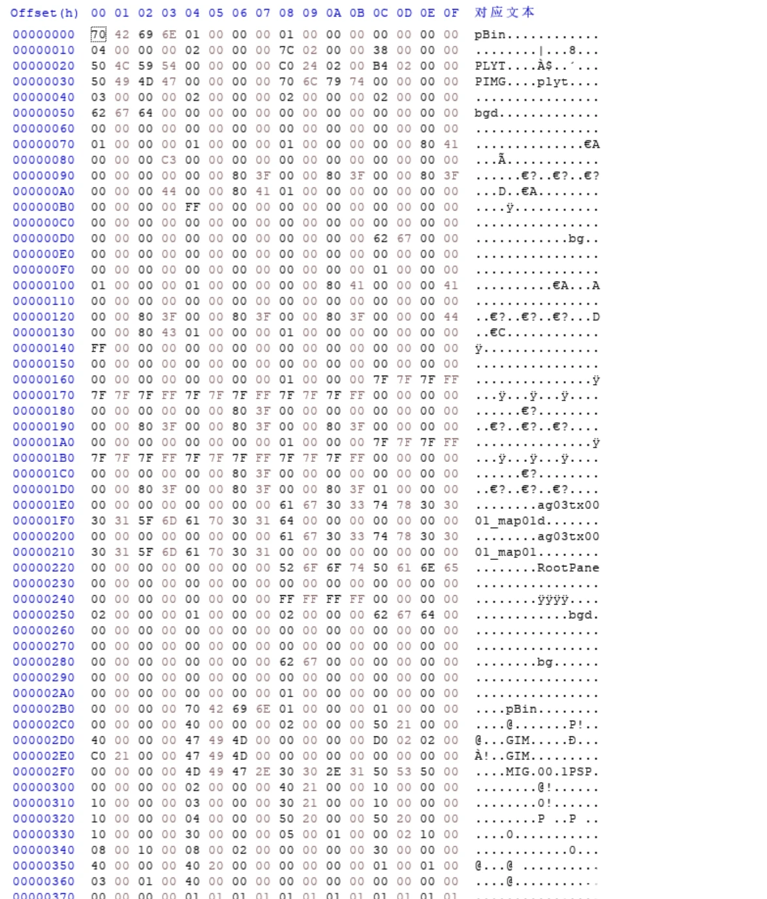
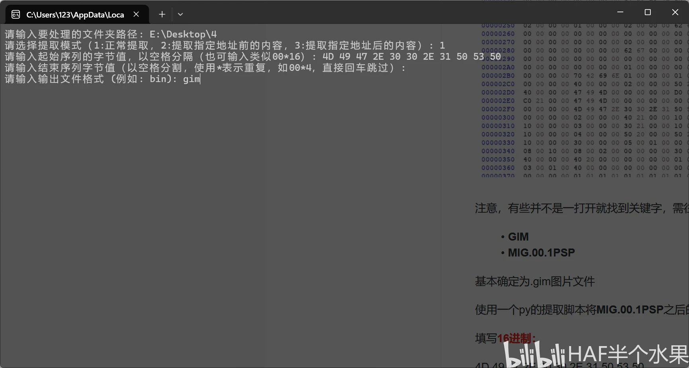
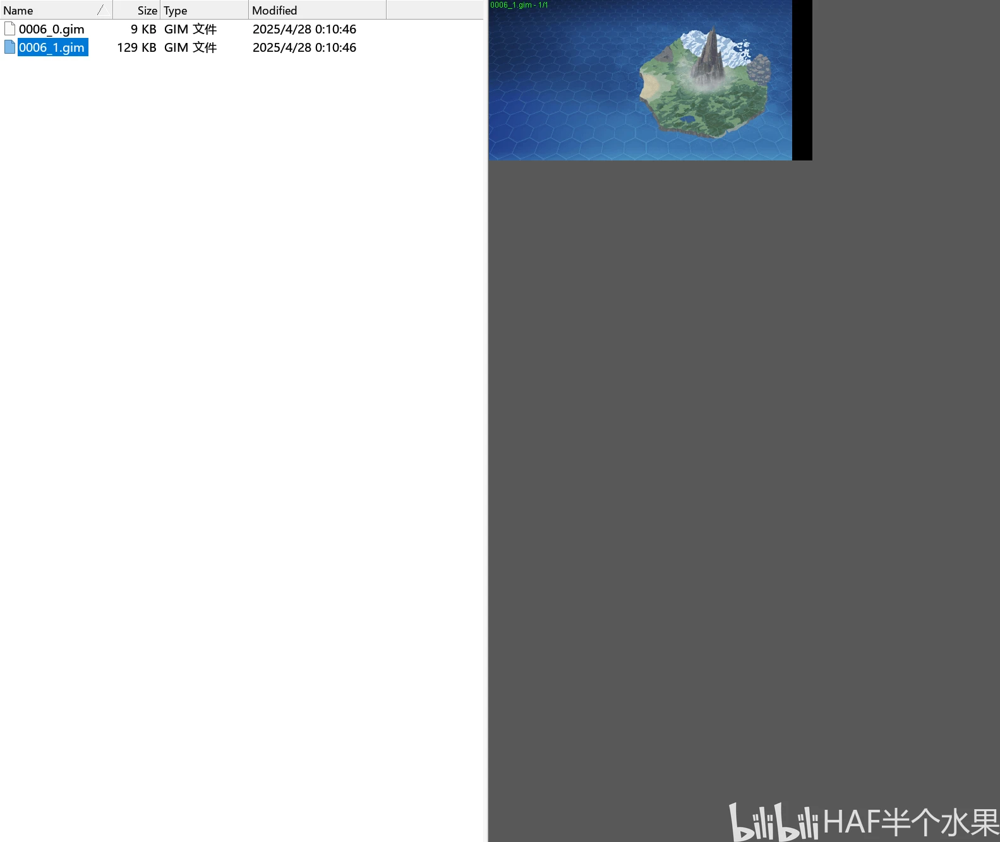
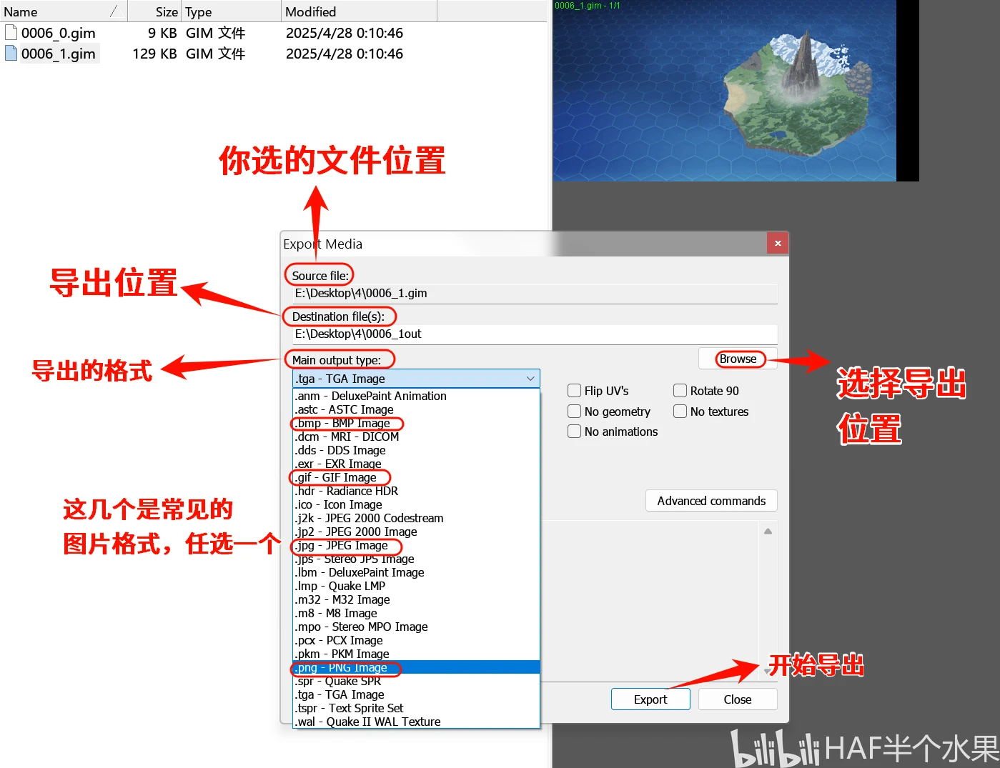
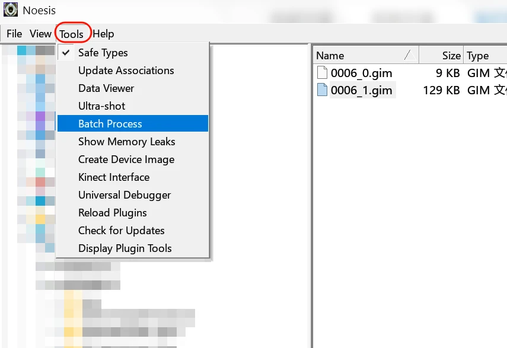
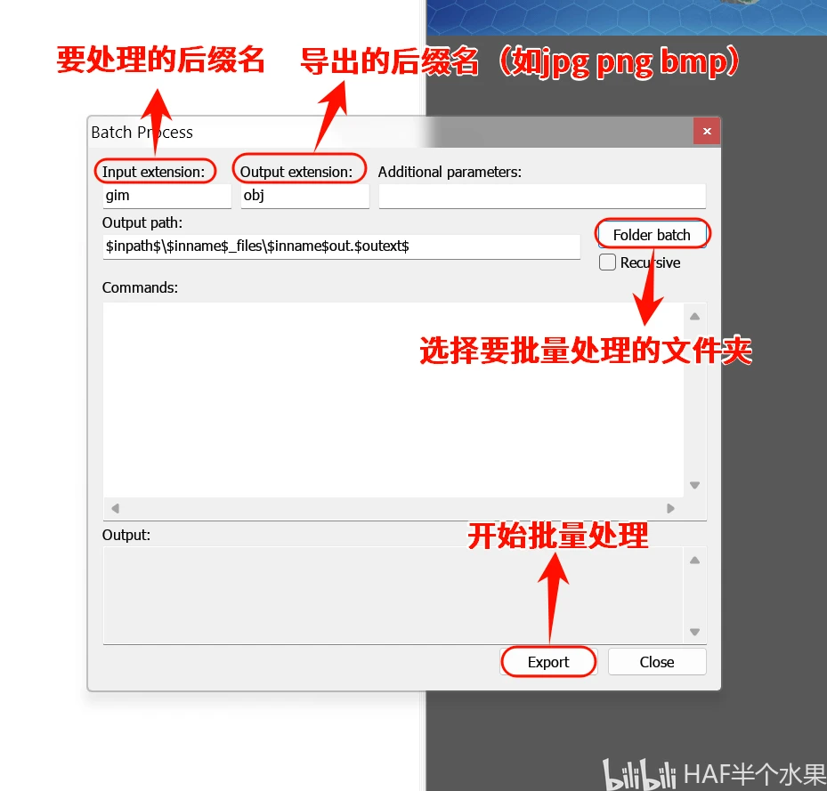

有些小伙伴遇到解包出来后没有后缀名，不知所措。现在我来试着分析一下该格式。

<!-- truncate -->

关于该文章......

该文章为我在Bilibili上的备份，[原文](https://www.bilibili.com/opus/1060581451532075014)

预防哪天平台抽筋被删除。

**.gim**格式 是索尼PSP使用的图像，支持256色，32色查找表和Alpha通道的图像， 用于存储主题图标和其他图形的预览和图像。

开始之前，请确认已安装下面的软件：

- python
- 16进制编辑器（如HxD Hex Editor）
- 文中提到的工具

首先用16进制编辑器打开文件：

注意，有些并不是一打开就找到关键字，需往下翻页。在这张图片中，关键字为：

- GIM
- MIG.00.1PSP

基本确定为.gim图片文件。

使用一个py的提取脚本将MIG.00.1PSP之后的部分提取出来。

填写**16进制**：

`4D 49 47 2E 30 30 2E 31 50 53 50`

也可以在16进制编辑器中复制。

之后得到一个或多个`.gim`文件。

有些人直接双击`.py`文件没有出现上面的提示，在确保python已经正确安装后，按

`win+r`，输入cmd后确定打开。之后输入：

`python <py脚本路径>`

如我把脚本放在E盘的Desktop文件夹里，那么就写`python E:\Desktop\文件名.py`

或者写完python加空格后，直接将`.py`拖进去，回车运行。

接下来使用Noesis来转换图片

找到刚才的`.gim`文件，双击就可以预览：

在弹出的窗口中 **Source file** 就是你选的文件，**Destination file(s)** 是导出的位置，按 **Browse** 可以选择位置。

**Main output type**是将你选的文件导出为什么格式

要批量提取，选择左上角的**Tools**，选**Batch Process**

在弹出的窗口中，**Input extension**为要处理的格式，这里填`gim`

**Output extension**为导出后的文件格式，参考上面的常见图片格式（如`jpg`，`png`，`bmp`）

按**Folder batch**选择要批量处理的文件夹

顺利的话就可以得到常规的图片文件了。

## 文章工具

脚本文件自行复制代码，再粘贴到一个文本文件内，然后把`.txt`后缀改为`.py`

### 万能二进制提取.py

[我的Wiki](https://wiki.little-data.eu.org/zh/Gametoolkit/Python_scripts#万能二进制提取)

### Noesis

你也可以在网上找，应该找得到。找不到的我已上传至[Gametoolkit仓库](https://github.com/Little-Data/Gametoolkit)

文件很多的话请翻页，GitHub无法访问请另寻他法，我不会去解答这个问题的