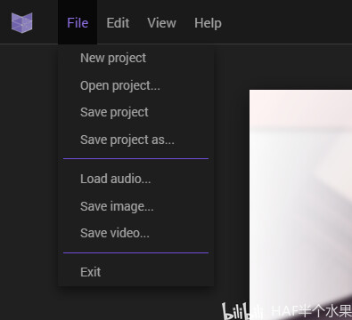

Astrofox简单教程

<!-- truncate -->

关于该文章......

该文章为我在Bilibili上的备份，[原文](https://www.bilibili.com/opus/757711361697382401)

预防哪天平台抽筋被删除。

最不喜欢废话，直接开始。

## 前排提示

需要你<Highlight color="red" msg="不要动不动就不干了" cursor="grabbing">动手能力强</Highlight>，<Highlight color="red" msg="不会也是干瞪眼" cursor="grabbing">会点英语</Highlight>，遇到未提及的问题<Highlight color="red" msg="求你不要用百度，求你看清“广告”两个字，求你有点信息分辨能力" cursor="grabbing">会用搜索引擎搜索问题</Highlight>。本文章只是最基础的教程。

我<Highlight color="red" cursor="not-allowed">不常用</Highlight>此软件，有些问题我也不会。

## 系统要求

Windows 7+、MacOS 10.10+（Yosemite 或更新版本）和 Linux（Ubuntu 12.04+、Fedora 21、Debian 8）上运行。需要能够运行WebGL的显卡。

## 下载安装

官方网站：https://astrofox.io

按`1`下载（软件是干什么的自己网页翻译）可有加载不出来的小窗口，右上角关掉，再点一次`1`

选择自己的操作系统，我是Windows系统（拿Win7演示），所以按`2`下载。

极大概率下载速度感人，耐心等待。

等了一世纪之后，下载完成，打开它直接自动安装，全程不用多余操作。完成之后自动打开。

## 界面

**1. 菜单栏**

可以在此处访问所有文件和应用程序命令。

**2. 舞台**

舞台是显示和效果的位置。

**3. 控制坞**

控制坞包含用于控制舞台上元素的输入。图层面板允许您进行合成 不同的可视元素层和控制面板允许操作每个可视元素。

**4. 音频播放器**

这是加载音频文件后控制音频的地方。

点击`File`，`Load audio`载入音频，就能看到这界面。

## 操作

上面是最基本的效果，首先我们更改当前的分辨率，会影响导出视频的分辨率。点击`Edit`，`canvas`

在这里可调画面宽（Width）高（height）和背景颜色（Background Color）

:::warning

如果按照图中的设置，则会导出480p的视频

如果想导出1080p的视频，则宽（Width）为1920，高（height）为1080

当然也可以设置其它分辨率

:::

调好之后发现页面有点大，可以调节下面的缩放，不影响导出视频分辨率。

接下来重点讲右面板，我已经把默认的全部清空。

1是场景添加（Add Scene）按钮，<Highlight color="red">必须添加场景</Highlight>才能进行下一步操作。<Highlight color="red">上下箭头调整顺序</Highlight>。

任何项目都可以**双击名称改名**。

2、3是添加显示（Add Display），在这里可以添加一些文件或特效效果（Effects）

选择图片（Image）来添加背景,可以看到成功添加。

<Highlight color="red">再添加一个场景才能添加各种效果在背景上</Highlight>，否则全被背景盖住。

点2关掉现在的波形图，<Highlight color="red">关不关都不会被添加到最终的视频中</Highlight>，按1可以设置跟随音乐的效果，按3可取消，手动设置。

## 导出视频

点击`File`，`Save Video`

之后看到一个配置文件窗口

1是要把文件储存到那个地方。

2是我们之前加载的音频文件（保持默认即可）。

3是编码格式（保持默认即可）。

4是视频质量（保持默认即可）。

5是视频帧率，按需求更改。

6和7分别是渲染的开始时间和结束时间（保持默认即可）。

按Start开始保存。

之后看电脑配置等它保存完成。

---

这里还有太多没讲，只是粗略地介绍了一下。

有问题自己网上找吧，我也只懂基本操作方法。