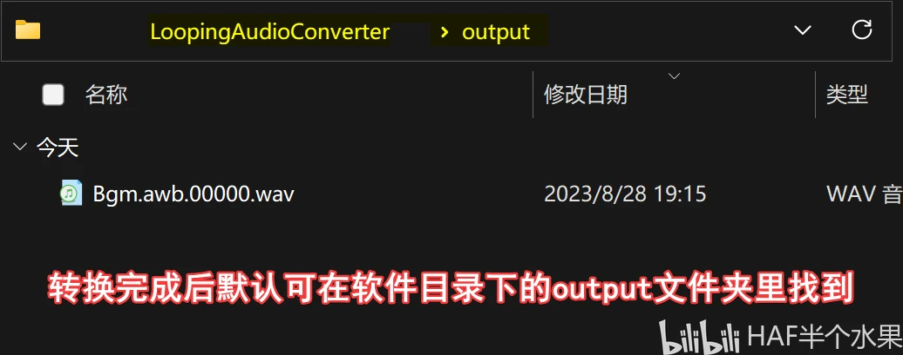

解决经过DKZ Studio处理后的音频声音过小的问题。

<!-- truncate -->

关于该文章......

该文章为我在Bilibili上的备份，[原文](https://www.bilibili.com/opus/834892215897554968)

预防哪天平台抽筋被删除。

感谢热心群友发现的问题！

下面是一张频谱图，`01`为其它软件转换。

:::note

抱歉图中的“DZK”应为“DKZ”

:::

可以发现频谱图01部分的颜色亮一些，而DKZ声音主要集中在4000内。

这就导致部分被转换的音频声音低沉，音量小。

---

**解决方案**

DKZ自身的问题只能找其它软件。

这个其它软件就是 **LoopingAudioConverter**

:::warning

已经提前把要转换的音频文件导出。

:::

---

**方法**

01.到Github下载软件

https://github.com/libertyernie/LoopingAudioConverter/releases

02.解压

03.看下图

:::warning

打不开的检查是否安装.NET

:::

这个工具也在我的游戏处理仓库发布了，里面有超多工具可以探索。

https://github.com/Little-Data/Gametoolkit