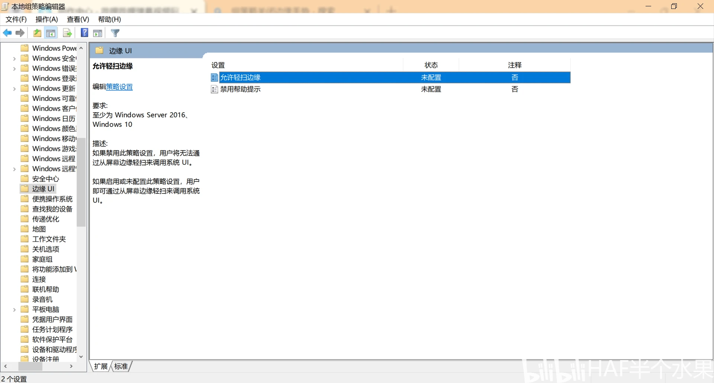
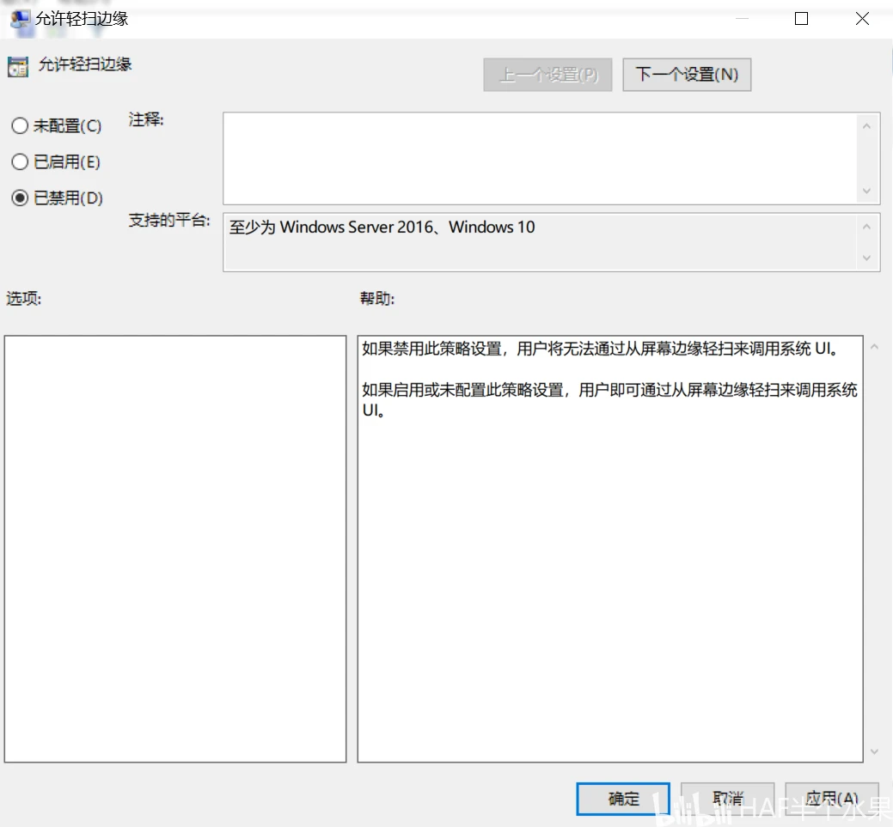
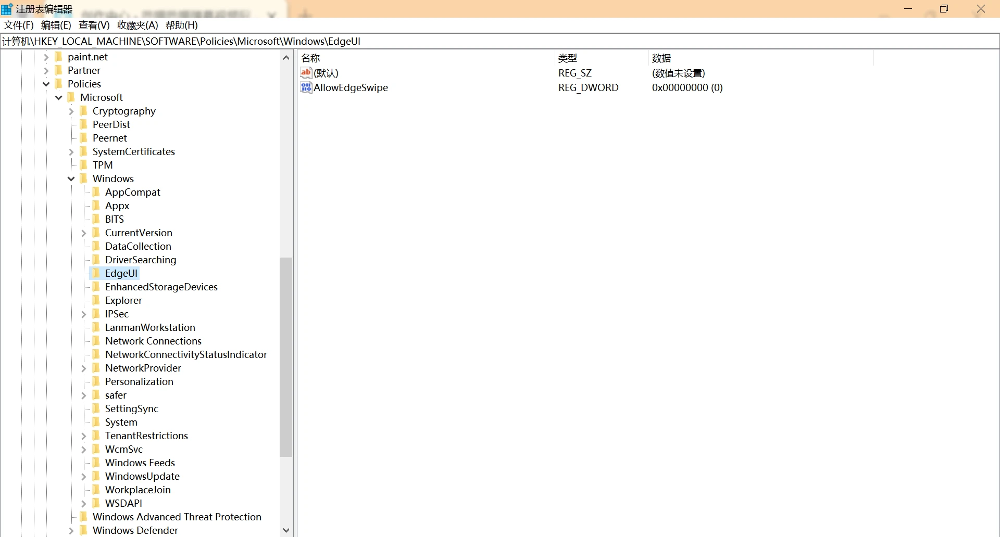
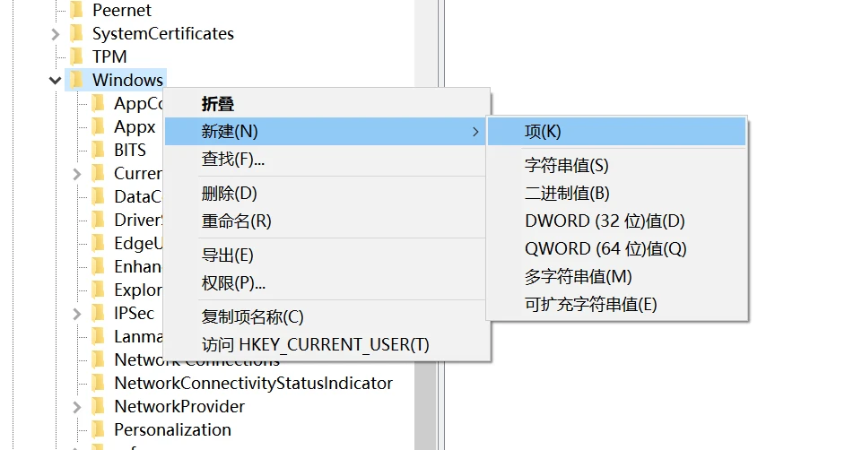
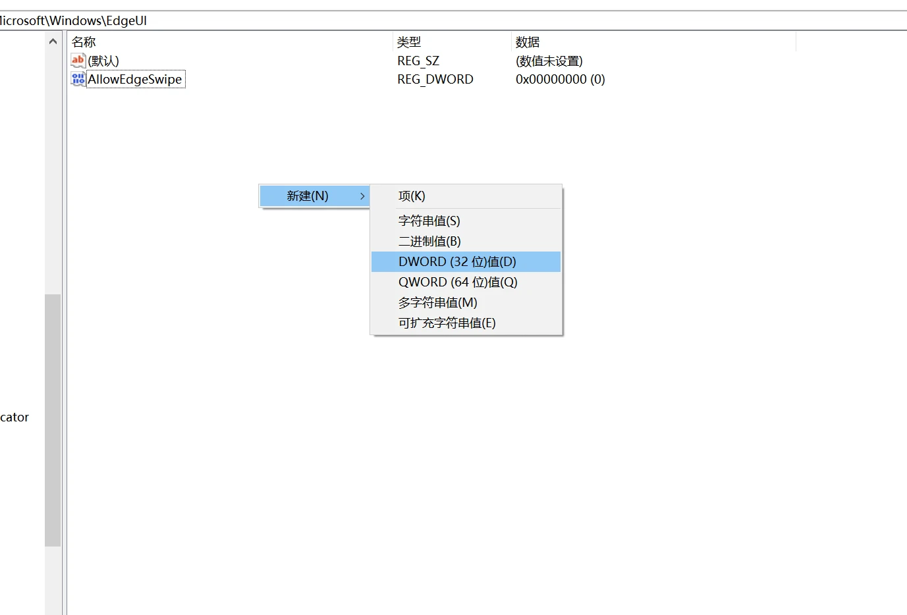
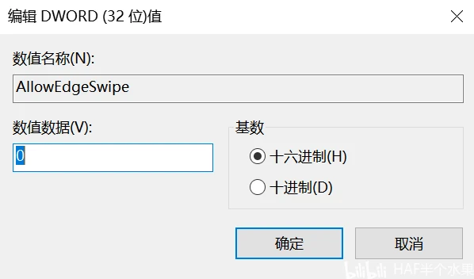

也许在使用希沃设备书写时不可避免地触碰屏幕左或右边缘，于是就弹出通知中心或最近任务页面。设置和控制面板都没有关闭选项，让老师不知所措

这里以Win10为例，如何禁用这一特性。

<!-- truncate -->

<details>
<summary>关于该文章......</summary>

该文章为我在Bilibili上的备份，[原文](https://www.bilibili.com/opus/915428749682409512)

预防哪天平台抽筋被删除。

</details>

下面介绍两种方法，任选其一。

## 更改组策略

按键盘`Win+R`，输入`gpedit.msc`打开组策略编辑器

展开到 `计算机配置>管理模版>Windows 组件>边缘 UI`



找到`允许轻扫边缘`，选择`已禁用`，保存



:::warning

之后 **注销登录** 或 **重启电脑**

:::

## 更改注册表

按键盘`Win+R`，输入`regedit`打开注册表

定位到以下路径：

```bash showLineNumbers
计算机\HKEY_LOCAL_MACHINE\SOFTWARE\Policies\Microsoft\Windows\EdgeUI
```



如果没有请在`Windows`下新建项，重命名为`EdgeUI`



在`EdgeUI`下新建`DWORD(32位)值`，名为`AllowEdgeSwipe`



将它改为0



:::warning

之后 **注销登录** 或 **重启电脑**

:::