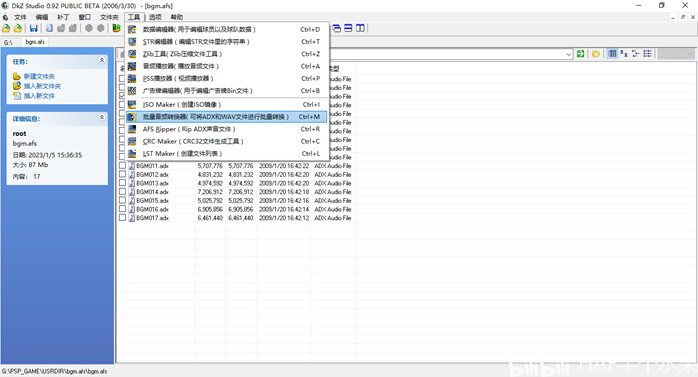
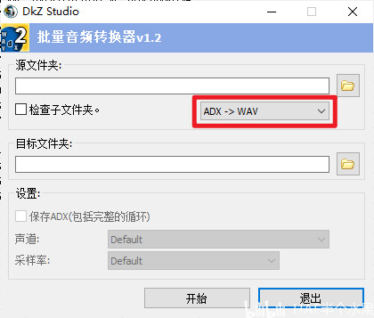

DkZStudio 简单使用，处理一些PSP游戏镜像

<!-- truncate -->

关于该文章......

该文章为我在Bilibili上的备份，[原文](https://www.bilibili.com/opus/747637747833896984)

预防哪天平台抽筋被删除。

:::warning[声明！]

工具仅限个人修改使用，禁止违反相关条例使用！如出现任何争端本文不负任何连带责任！

:::

## 引入

在制作《龙与虎！Portable》PSP游戏原声带时遇到困难了，发现打开ISO文件后都是一些不常见的格式

> *其中asf文件是音频压缩文件，pmf为视频文件。*

如果用格式工厂直接转换会出错。

所以就开始漫长的找工具之旅。这种工具是真的难找，网上一堆要么失效，要么<Highlight color="red">登录付费下载</Highlight>，这不是恶心人吗？

还好，这些工具如大海捞针一般被我找到了：

## 换为中文

<Block>
图中的**PSP汉化工具**里有个**DkZStudio**就可以解决音频转换问题。第一次打开是软件是<Underline color="red">**西班牙语**</Underline>，要把`Simple Chinese.dsl`文件复制到软件安装目录下的`language`文件夹下，打开软件：
</Block>

点开红色框的菜单进入设置，按下面步骤进行设置。

成功切换语言之后我们再打开ISO文件里的内容，可以处理音乐文件了。

## 转换 adx 文件

接下来把`adx`文件转换为`wav`文件，点击红色框`1`内按钮，提取全部音频或按`2`框内按钮，只提取选择的音频：

之后选择工具按钮选择<Underline color="red">批量音频转换器</Underline>：

选好刚才提取音频所在的文件夹，<Highlight color="red">注意红色框内的转换，一开始是wav转adx文件</Highlight>，把它切换一下：

完成转换

部分被转换的音频声音低沉，音量小的[解决方案](./DKZ-Studio音质问题解决)

[将pmf文件转换为MP4](./pmftools-guide)

## 文件获取

https://github.com/Little-Data/Gametoolkit

里面还有其它工具，自己摸索吧。

## 参考资料

01. PSP工具包：https://bbs.oldmanemu.net/thread-5147.htm

02. Pmftools：https://github.com/TeamPBCN/pmftools

03. UMD Stream Composer：https://wololo.net/downloads/index.php/download/8188