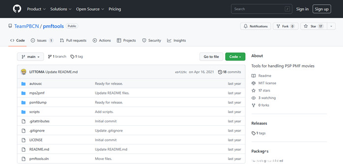
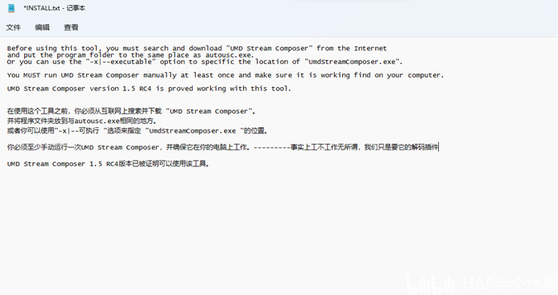
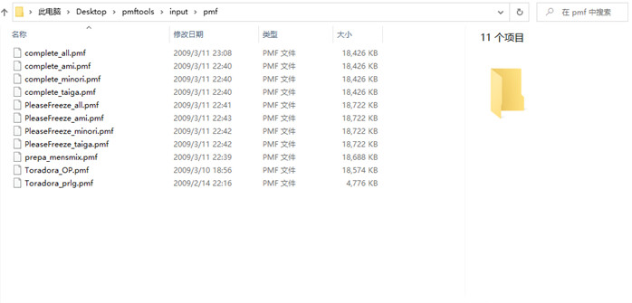

pmftools 简单使用，将pmf文件转换为MP4文件

<!-- truncate -->

关于该文章......

该[文章](https://www.bilibili.com/opus/747637747833896984)为内容拆分文章。

预防哪天平台抽筋被删除。

:::warning[声明！]

工具仅限个人修改使用，禁止违反相关条例使用！如出现任何争端本文不负任何连带责任！

:::

`pmf`如何转换成MP4呢？下面就介绍一个软件pmftools，GitHub开源软件。

下载下来，打开，发现还要另外的插件：

为了不那么麻烦我已经整合好了（如果不怕麻烦插件链接在参考资料里），看看怎么处理。首先把文件放在`程序所在位置（这里我放桌面）\input\pmf`这个目录下：

返回`pmf_to_mp4.bat`所在文件夹，打开它，稍等转换，就能得到MP4文件

## 文件获取

https://github.com/Little-Data/Gametoolkit

里面还有其它工具，自己摸索吧。

## 参考资料

01. PSP工具包：https://bbs.oldmanemu.net/thread-5147.htm

02. Pmftools：https://github.com/TeamPBCN/pmftools

03. UMD Stream Composer：https://wololo.net/downloads/index.php/download/8188