处理希沃白板Win系统和安卓系统的一些限制，顺便解决了微软商店的一些问题

<!-- truncate -->

<details>
<summary>关于该文章......</summary>

该文章为我在Bilibili上的备份，[原文](https://www.bilibili.com/opus/738367597754449944)

预防哪天平台抽筋被删除。

</details>

:::warning

本文仅供参考！请谨慎操作！否则有可能损坏系统！

:::

好了，客套话说完了，直接开始吧

## 锁屏界面壁纸更换

想换锁屏壁纸换个心情，结果发现  <span style={{color:'red'}}>*其中某些设置已由组织隐藏或管理。</span>

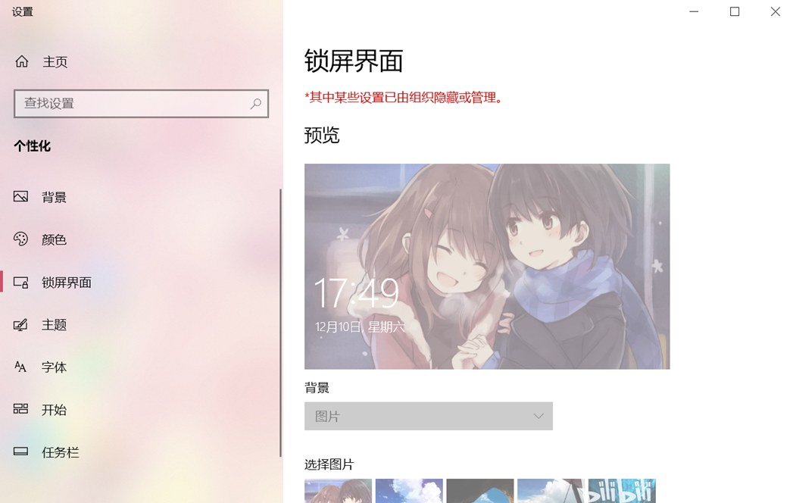

**解决方法：**

按 `Windows + R` 键（或者右击屏幕左下角开始菜单）先打开运行窗口，输入`regedit`打开注册表

找到以下键值：

```bash showLineNumbers
计算机\HKEY_LOCAL_MACHINE\SOFTWARE\Policies\Microsoft\Windows\Personalization
```

双击`NoLockScreen`将数值数据改成`0`，确定保存，然后重新打开设置

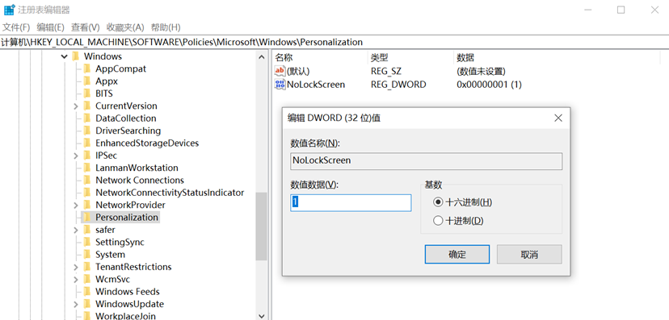

在这里其实删除注册表值也行，但我这里不这样做，方便以后改回。

## 在登陆时背景图片变模糊的解决办法

按 `Windows + R` 键（或者右击屏幕左下角开始菜单）先打开运行窗口，输入`gpedit.msc`打开组策略编辑器。

在左边定位到`计算机配置/管理模板/系统/登录`

在右边找到`显示清楚的登录背景`，双击打开。

选择`已启用`，确定保存。

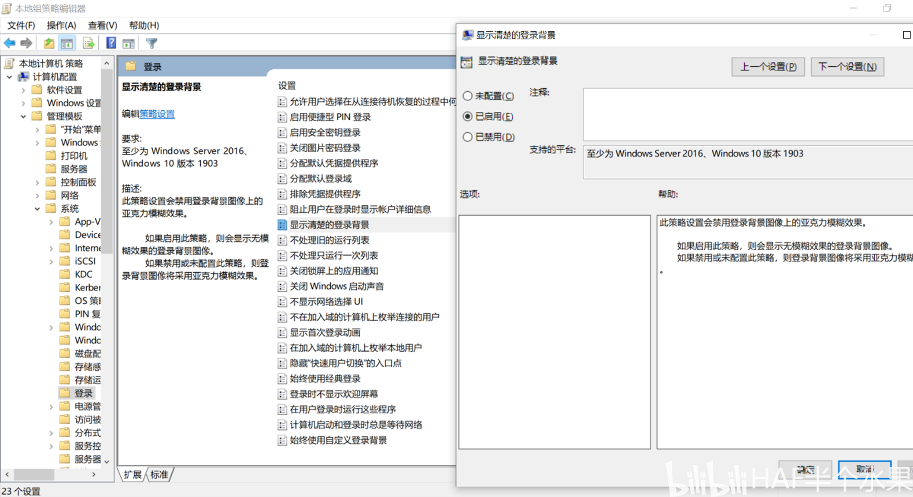

## Microsoft store显示0x8024500c或无法更新

打开Microsoft store发现卡住或无法更新，一般情况下是因为希沃禁用了Windows update的相关服务。

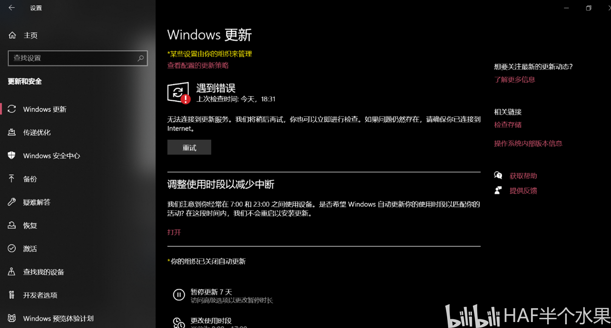

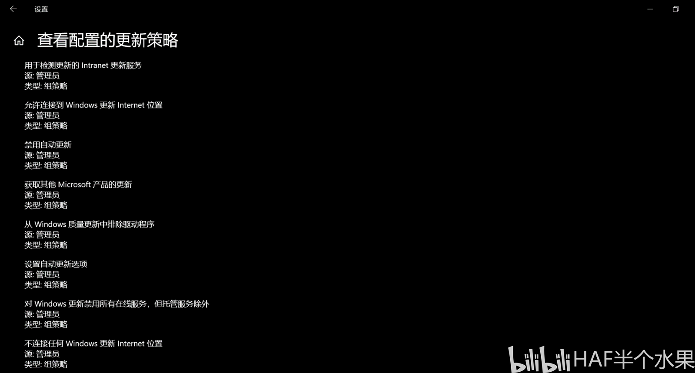

**解决方法：**

按 `Windows + R` 键（或者右击屏幕左下角开始菜单）先打开运行窗口，输入`regedit`打开注册表

找到以下键值：

```bash showLineNumbers
计算机\HKEY_LOCAL_MACHINE\SOFTWARE\Policies\Microsoft\Windows\WindowsUpdate
```

<Highlight color="red">（包括子目录下的AU项）</Highlight>

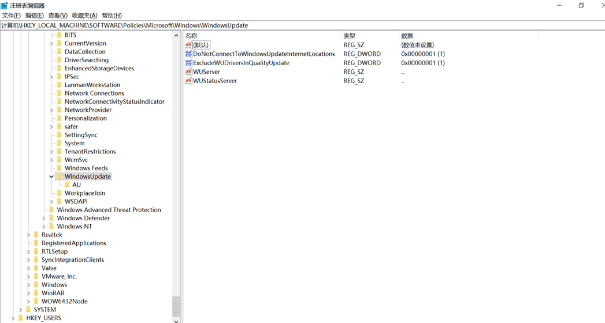

由于我们只使用Microsoft store，更改后面两项。把数值数据里的内容全部删除，确定保存。

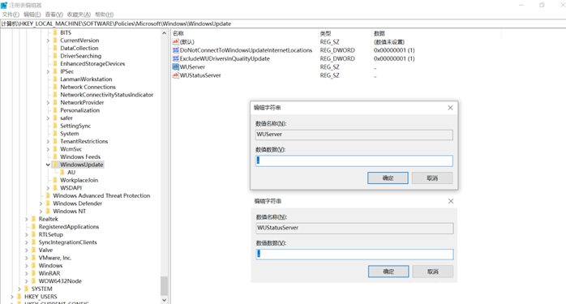

> *`WUserver`和`WUStatusServer`,把数值数据里的内容全部删除*

在左边打开AU项，把UseWUServer的数值数据里的1改为0，确定保存。

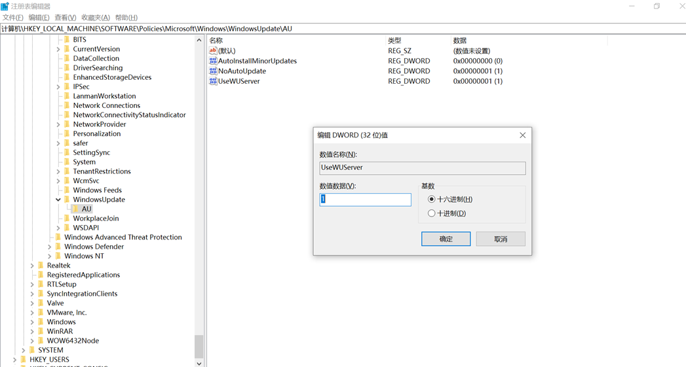

<Block>
摘自[微软文档](https://learn.microsoft.com/zh-cn/windows/deployment/update/waas-wu-settings#do-not-connect-to-any-windows-update-internet-locations)

**UseWUServer (REG_DWORD)**

将此值设置为 1 可将自动更新配置为使用运行软件更新服务而不是 Windows 更新的服务器

**WUServer (REG_SZ)**

此值通过 HTTP 名称设置 WSUS 服务器（例如  `http://IntranetSUS`)

**WUStatusServer (REG_SZ)**

此值将按 HTTP 名称设置 SUS 统计信息服务器（例如 `http://IntranetSUS`)
</Block>

更改完成后<Highlight color="red">重启电脑</Highlight>

:::note

如此操作后就能顺利更新Microsoft store，也能手动检查并更新Windows（因为注册表里的`NoAutoUpdate`的值仍为`1`）进入设置仍然会看见更新策略，不过不妨碍更新。毕竟这里主要解决无法使用Microsoft store

:::

## 希沃安卓系统安装第三方软件

默认情况下，希沃不允许安装第三方软件，这里需要希沃的调试菜单。

<Underline color="red">不同的机器显示不一样，但方法都差不多。</Underline>

**解决方法：**

切换到安卓系统，打开应用列表

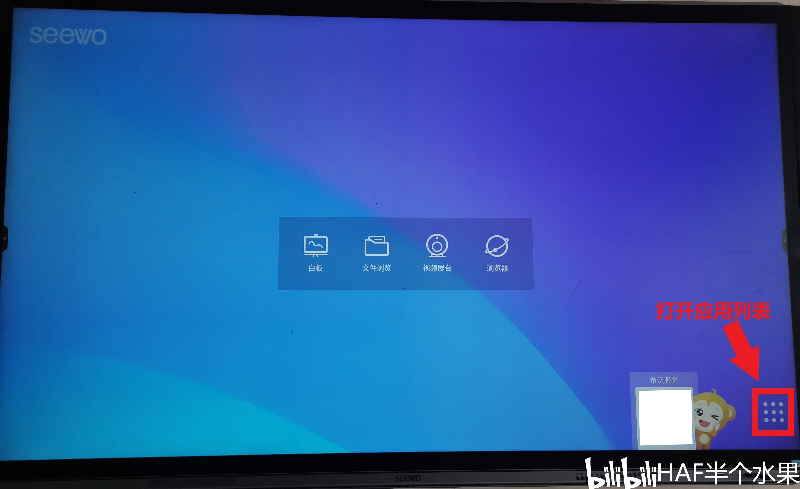

进入设置

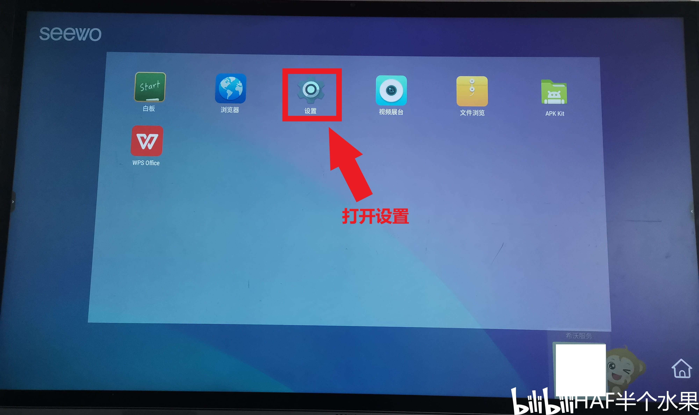

点开设备信息

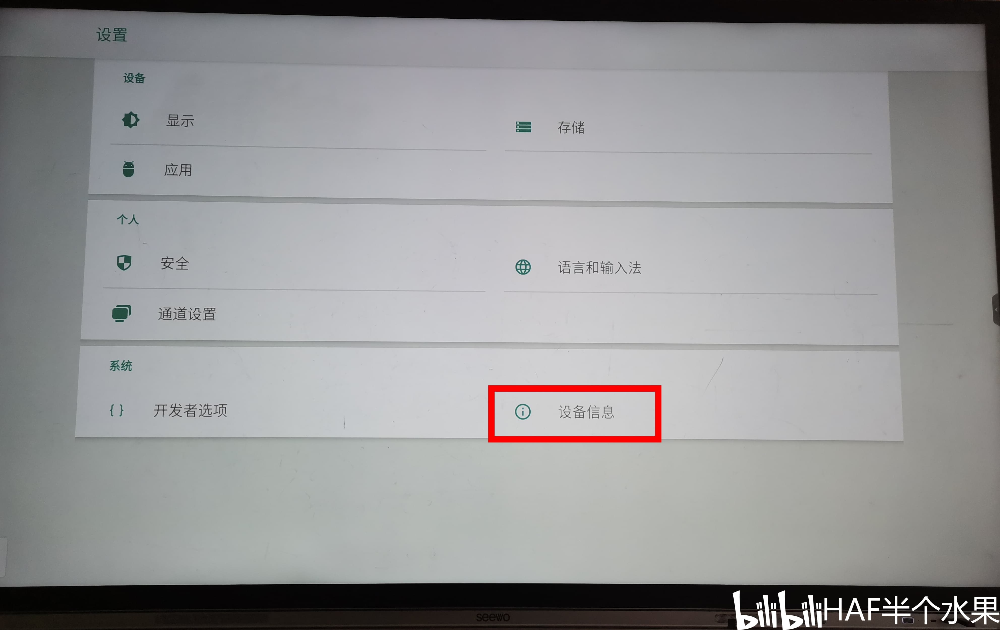

<Block>
先点<Highlight color="red">内核版本多次</Highlight>，再点<Highlight color="red">Android版本多次（如果要像上图一样显示开发者选项，狂点版本号多次）</Highlight>。可能有些机器点内核版本多次后会进入到一个黑色界面，底部有一个小白条，点它（还是长按我忘记了）进入彩蛋界面（用不用再点Android版本多次我也忘记了）
</Block>

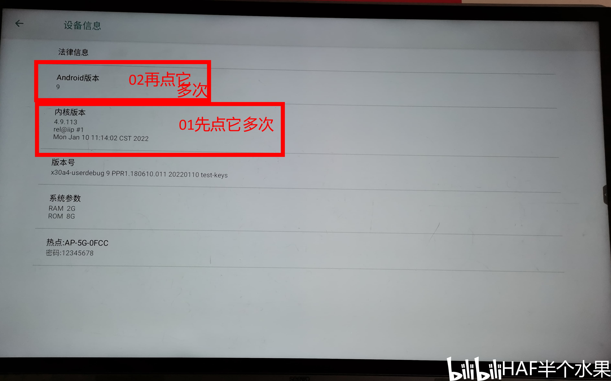

之后进入彩蛋界面，要与它玩几下（就是随便点点屏幕）

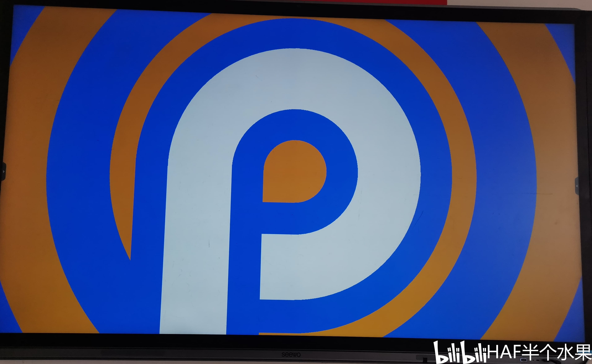

找到返回按钮，底部有小白条的机器返回就能出现调试菜单，但我这里不行


> *找到返回按钮（位置因机器而异）*

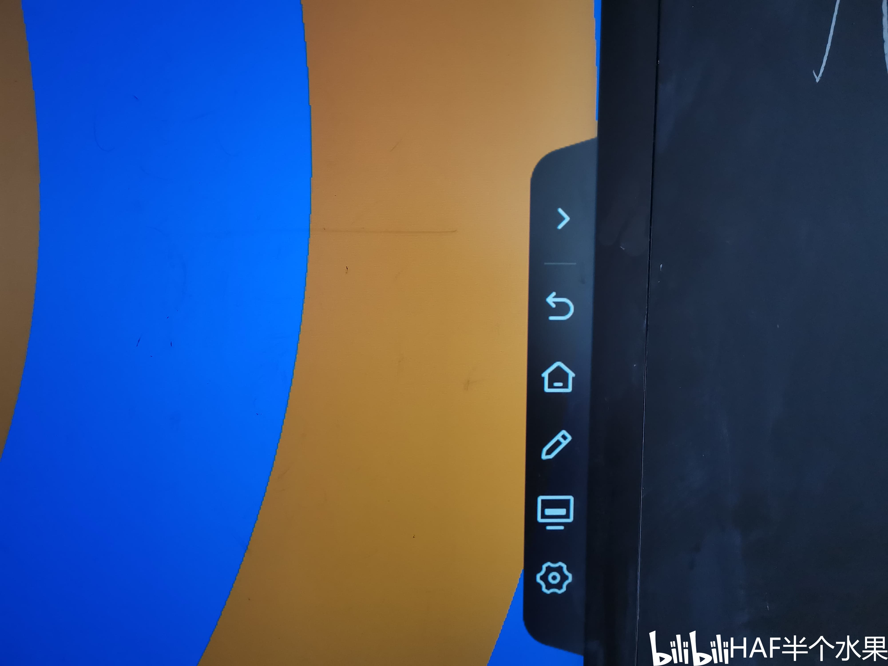

> *找到返回按钮（位置因机器而异）*

返回后再点<Highlight color="red">内核版本多次</Highlight>，即可看到调试菜单（底部有小白条的机器点返回按钮就出现调试菜单）

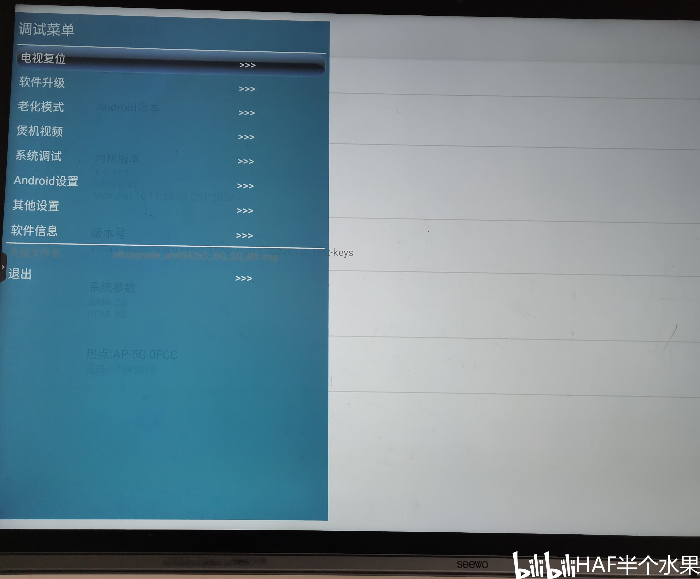

接着找到Android设置，未知软件安装。默认为关闭，点击打开它，会有一个警告窗口，确认打开即可

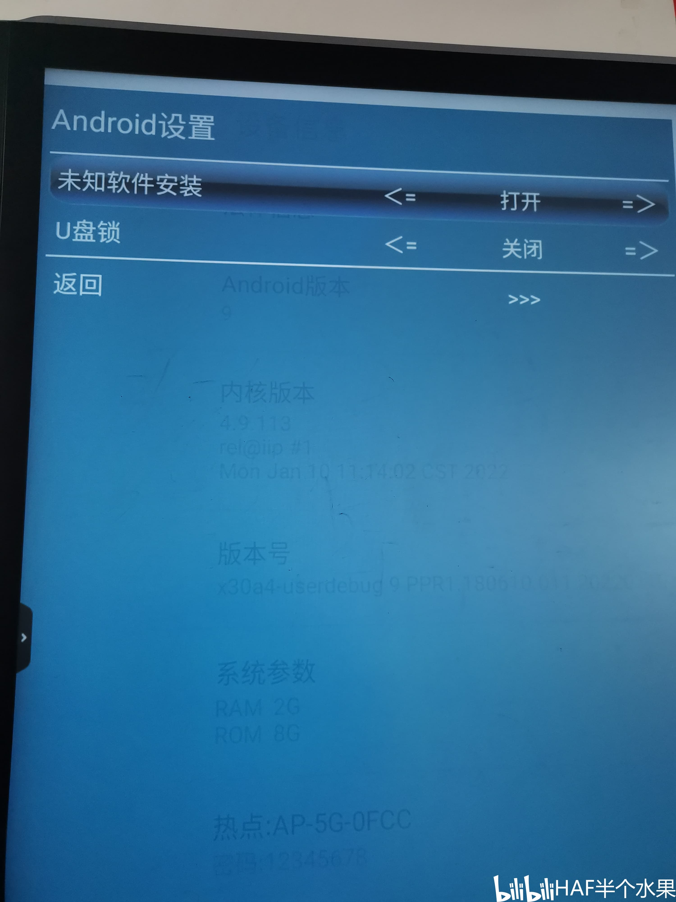

## 参考资料

01. 锁屏界面壁纸更换

	https://www.bilibili.com/read/cv7607064

02. 希沃安卓系统安装第三方软件

	https://help.seewo.com/yunban/upsMmeqqn9