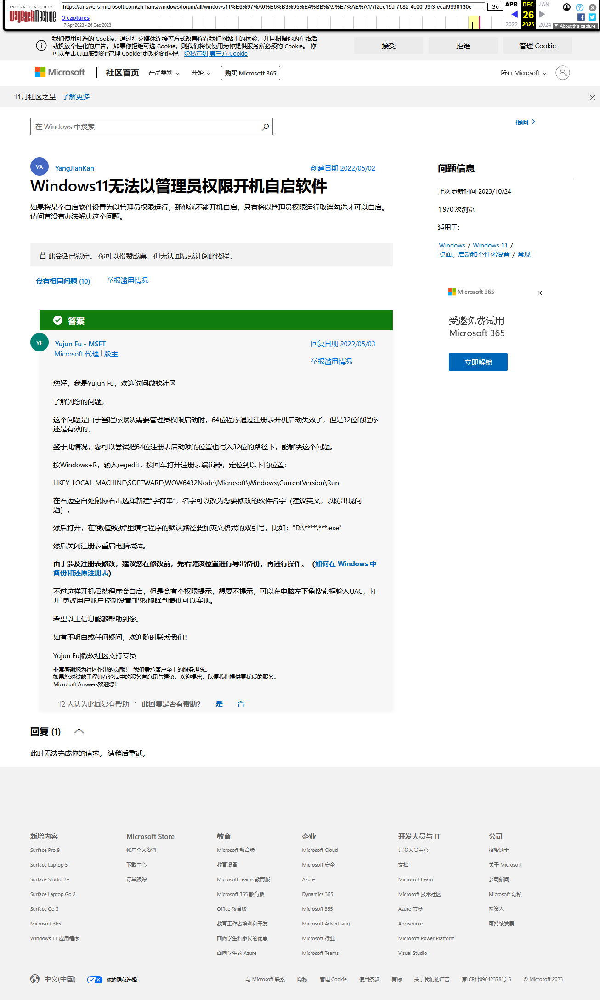
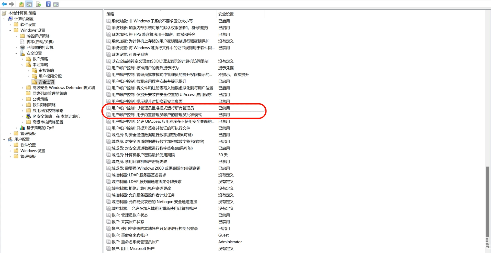
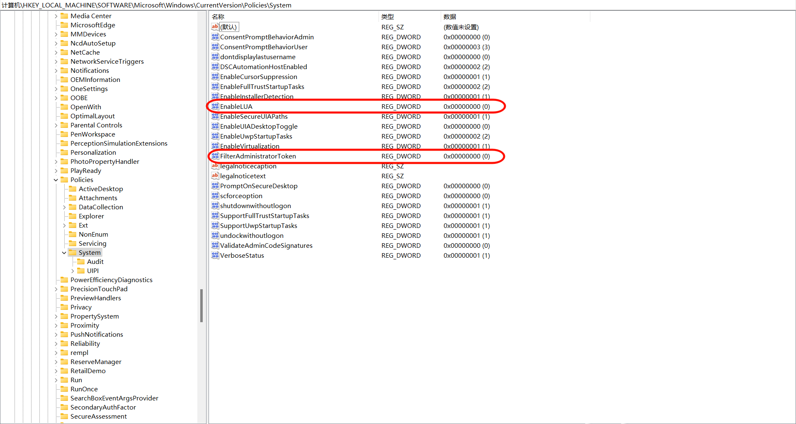

解决Win11无法以管理员权限开机自启软件，带盾牌图标软件无法开机自启

<!-- truncate -->

<details>
<summary>关于该文章......</summary>

该文章为我在Bilibili上的备份，[原文](https://www.bilibili.com/opus/980658466703015937)

预防哪天平台抽筋被删除。

</details>

## 微软方法

按`Windows+R`，输入`regedit`，按回车打开注册表编辑器，定位到以下的位置：

```bash showLineNumbers
HKEY_LOCAL_MACHINE\SOFTWARE\WOW6432Node\Microsoft\Windows\CurrentVersion\Run
```

在右边空白处鼠标右击选择新建`字符串`，名字可以改为您要修改的软件名字（建议英文，以防出现问题），然后打开，在`数值数据`里填写程序的默认路径要加英文格式的双引号，比如：`"D:\****\***.exe"`

然后关闭注册表重启电脑试试。

不过这样开机虽然程序会自启，但是会有个权限提示，想要不提示，可以打开“更改用户账户控制设置”把权限降到最低可以实现。

这个问题是由于当程序默认需要管理员权限启动时，64位程序通过注册表开机启动失效了，但是32位的程序还是有效的。可以尝试把64位注册表启动项的位置也写入32位的路径下，能解决这个问题。

微软[这个方法](https://answers.microsoft.com/zh-hans/windows/forum/all/windows11%E6%97%A0%E6%B3%95%E4%BB%A5%E7%AE%A1/7f2ec19d-7682-4c00-99f3-ecaf9990130e)在我的电脑上可以在不是默认以管理员权限的情况下可用。但微软又发力了，这个回答被删除了。


> *FW微软*

不过还好我的历史记录还在，可以用[网页时光机](https://web.archive.org/web/20231226114123/https://answers.microsoft.com/zh-hans/windows/forum/all/windows11%E6%97%A0%E6%B3%95%E4%BB%A5%E7%AE%A1/7f2ec19d-7682-4c00-99f3-ecaf9990130e)抢救一下。



以下为旧方法：

:::warning

下面教程将会关闭UAC，并默认会以管理员权限运行。请自行判断软件是否安全，以及知道自己这样做是为了什么。

:::

## 组策略编辑器

如果你的系统为家庭版，则没有这个功能，跳过该步骤。没有测试跳过该步骤后是否有效。

按 `Win + R` 打开运行，输入：`gpedit.msc`

打开后转到：`计算机配置-windows设置-安全设置-本地策略-安全选项`

找到：

`用户账户控制:以管理员批准模式运行所有管理员`

`用户账户控制:用于内置管理员账户的管理员批准模式`

禁用这两个。



## 注册表

按 `Win + R` 打开运行，输入：`regedit`

打开后转到：

```bash showLineNumbers
计算机\HKEY_LOCAL_MACHINE\SOFTWARE\Microsoft\Windows\CurrentVersion\Policies\System
```

找到：

`EnableLUA`

`FilterAdministratorToken`

将这两个的数值数据改为0。



## 额外：EnableLUA在下次开机后自动改为1的解决方法

新建一个文本文档，内容为：

```bash showLineNumbers
Windows Registry Editor Version 5.00

[HKEY_LOCAL_MACHINE\SOFTWARE\Microsoft\Windows\CurrentVersion\Policies\System]
"EnableLUA"=dword:00000000
```

保存，并将扩展名`.txt`改为`.reg`

比如我改为`DisableLUA.reg`


再新建一个文本文档，内容为：

```bash showLineNumbers
regedit /s [reg文件位置]
```

其中`[reg文件位置]`填入上面文件的位置

比如我存在D盘根目录下，则可以填入：

```bash showLineNumbers
regedit /s "D:\DisableLUA.reg"
```

保存，并将扩展名`.txt`改为`.bat`


下面的开机启动目录任选一个，推荐选择系统启动目录

按 `Win + R` 打开运行，任选一个粘贴

系统自启目录：`shell:Common Startup`

用户自启目录：`shell:Startup`

将改为`.bat`的文件放到里面

这样每次开机就能将`EnableLUA`的数值数据改为`0`了

## B站新版专栏编辑器该骂！

新版专栏编辑器是最史的，基本功能都不完善（例如无法将文中的某句话改变样式），没有代码块等等。我之前也有多次反馈，但都石沉大海，到现在都没有改善。一点也不关心用户反馈。反人类设计真的太多了，加上对用户反馈爱答不理的，凭什么会给你充钱！？