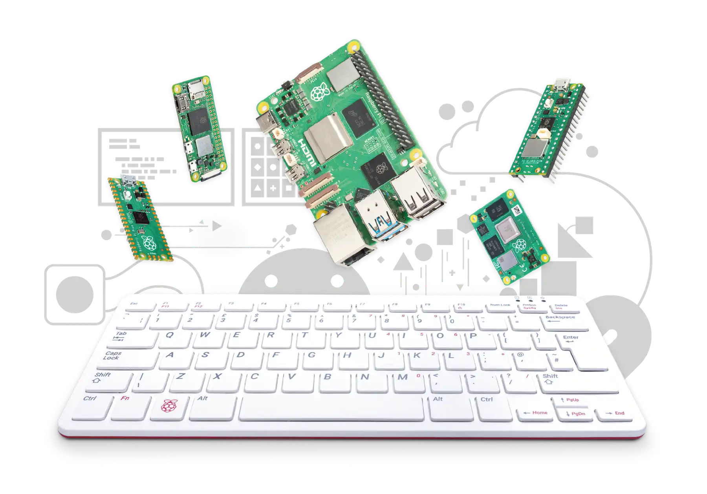

简单介绍树莓派使用方法

<!-- truncate -->

## 什么是树莓派？

[树莓派](https://www.raspberrypi.com)是一款由英国树莓派基金会开发的低成本、信用卡大小的单板计算机，旨在促进基础计算机科学教育。它配备ARM处理器、内存、USB接口、HDMI输出和GPIO引脚，可运行Linux等操作系统。功能强大且高度可定制，广泛用于编程学习、电子项目、机器人控制、家庭媒体中心及物联网应用。其开源生态和丰富配件使其成为创客、学生及开发者的理想工具，自2012年发布以来全球销量已超4000万台，是推动STEAM教育的重要平台。



它支持多种操作系统，如 Raspberry Pi OS、Ubuntu 等，能运行 Python、Scratch 等编程工具，并可连接传感器、摄像头等外设。还可用于媒体中心（如 Kodi）、复古游戏机、网络存储（NAS），甚至作为低成本台式机替代品。其紧凑设计、低功耗及丰富的 GPIO 接口使其成为创客、学生和开发者的理想平台。

**该文章主要结合我<Underline color="green">个人使用经验</Underline>编写，具体可查看官方文档**

[官方英文文档](https://www.raspberrypi.com/documentation)

[第三方中文文档](https://pidoc.cn)

至于怎么安装上面的教程已经讲的很清楚了，这里不再重复赘述。

**更多关于树莓派的文章请点击页面底部的“树莓派标签”**

## 不连接显示屏下安装/使用树莓派

由于树莓派的视频输出接口为 micro HDMI 接口，有时身边并没有这种线：


### 准备：

- 一台电脑
- 读卡器+SD卡
- 支持SSH远程访问的软件 *这里我使用 [Termora](https://github.com/TermoraDev/termora)*
- VNC Viewer *在电脑上显示树莓派画面，这里我使用 [UltraVNC Viewer](https://uvnc.com/downloads/ultravnc.html)*

下面以树莓派4B为例。

### 将系统写入SD卡

自行按照上面所给的官方文档操作，使用 Raspberry Pi Imager

:::warning

请务必在出现“您想应用自定义系统配置吗？”提示时点击“编辑设置”并配置好以下选项：

- 用户名和密码
- WiFi认证
- 主机名
- 时区
- 键盘布局
- 远程连接

请记住你的用户名和密码。

如果没有使用无线连接，WiFi认证必须要配置。

:::

### 使用SSH连接树莓派

将SD卡插入树莓派，开机。

只有获取到树莓派的局域网IP地址（如无特别说明，下面提到的IP地址均为局域网地址）才能使用SSH连接。

打开树莓派WIFI/有线所连接的路由器管理后台获取IP地址，使用SSH连接。

### 远程访问图形桌面

有两种方式可以远程访问图形桌面。

VNC 是通过局域网连接的，效果好一些。

Raspberry Pi Connect 是通过官方服务器来访问你的设备，有时延迟较高。

<Tabs>
<TabItem value="VNC" label="VNC访问"default>

<h3>启用 VNC 服务器</h3>

使用 `raspi-config` 在命令行上启用 VNC 服务器。

```bash showLineNumbers
sudo raspi-config
```

找到 `Interface Options` 进入选项。

找到 `VNC` 选择，出现提示 `Would you like the VNC Server to be enabled?` 选择 `Yes` 启用。

退出 `raspi-config`

:::tip
可以使用 `Tab` 键来选择不同的选项。
:::

<h3>连接VNC</h3>

使用 VNC Viewer 连接设备，先输入设备IP地址，开始连接。

开始连接时，会有证书警告。因为是设备自己生成的证书，点是才能连接。

之后要求输入用户名和密码，没问题的话就可以看到桌面了。

</TabItem>
<TabItem value="Raspberry Pi Connect" label="Raspberry Pi Connect">

:::note[系统要求]

使用这项服务最低系统要求为 `Raspberry Pi OS Bookworm`

:::

Raspberry Pi Connect 是树莓派官方提供的一种在线服务，可以通过他们的服务器来远程控制你的设备。

<h3>注册账号</h3>

访问 [Raspberry Pi Connect 官网](https://connect.raspberrypi.com) 找到 `create one for free` 选项创建账号。

相信借助网页翻译可以轻松创建账号。

<h3>升级系统组件</h3>

:::tip

这是官方推荐的步骤，防止内置的 Raspberry Pi Connect 版本过低出现问题。

不过默认的更新服务器在国外，难免会出现进度条卡住的情况。

可看自己的情况跳过这一步。

:::

检查更新

```bash showLineNumbers
sudo apt update
```

确认升级

```bash showLineNumbers
sudo apt full-upgrade
```

<h3>启动服务</h3>

启动 Pi Connect 服务。

```bash showLineNumbers
rpi-connect on
```

若提示无效命令，请看上面的升级系统组件后再安装，之后再启动。

```bash showLineNumbers
sudo apt install rpi-connect
```

<h3>将设备关联到账号</h3>

确保启动成功后再执行操作，全程联网。

```bash showLineNumbers
rpi-connect signin
```

若该命令成功远行，会有下面类似的消息出现：

```bash showLineNumbers
Complete sign in by visiting https://connect.raspberrypi.com/verify/XXXX-XXXX
```

将网址<Underline color="red">完整地</Underline>复制到<Underline color="red">已经登录好账号</Underline>的浏览器中访问。

确认关联设备。

<h3>远程访问</h3>

可以在[设备管理](https://connect.raspberrypi.com/devices)界面查看在线的设备，旁边的按钮可以控制该设备。

相信借助网页翻译可以轻松操作。
</TabItem>
</Tabs>