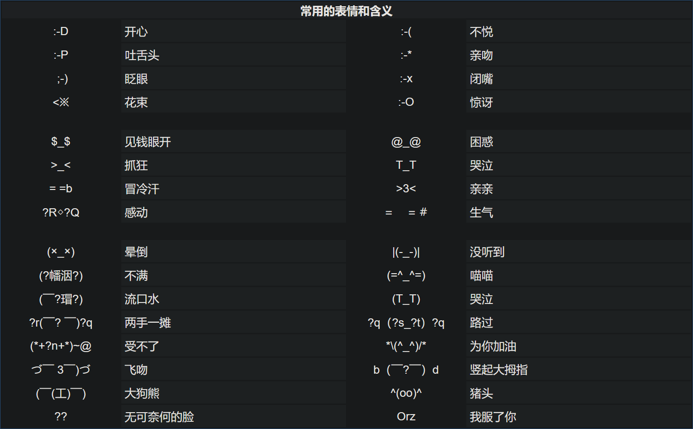

1982年9月19日，美国卡耐基-梅隆大学的斯科特-法尔曼教授在电子公告板，第一次输入了这样一串ASCII字符：“:-)”。人类历史上第一张电脑笑脸就此诞生。从此，网络表情符号在互联网世界风行，为社会广泛接受。 

<!-- truncate -->

**来源**

https://mail.qq.com/cgi-bin/readtemplate?check=false&t=about_symbolization