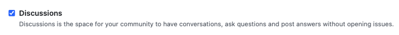
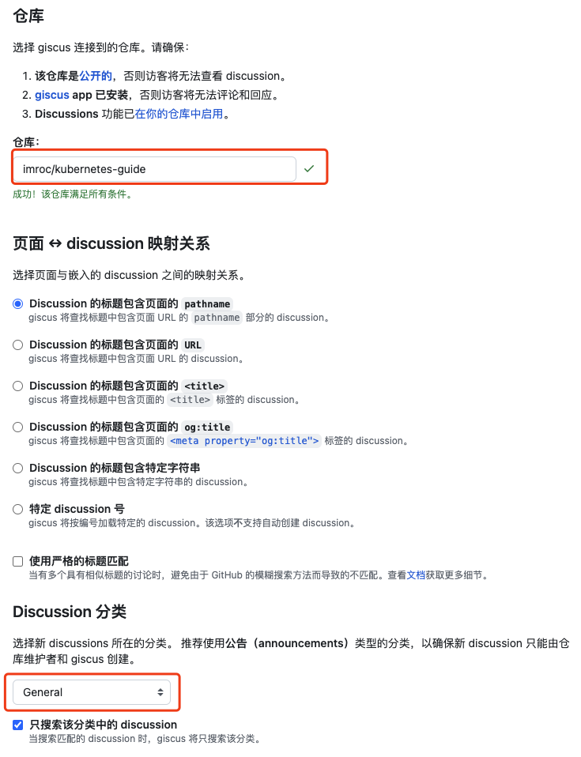
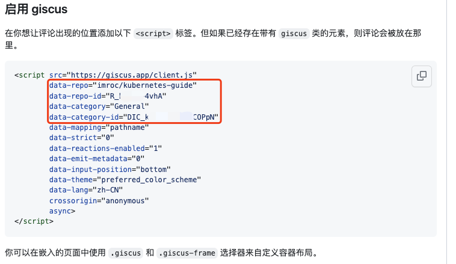
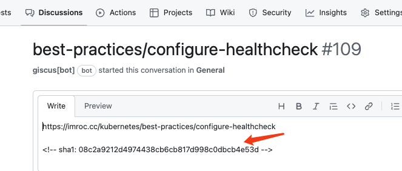
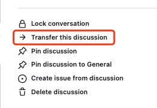

<details>
<summary>关于该文章...</summary>

该文章整合了其它方法，但大部分内容是来自imroc的，其余内容可看[参考资料](#参考资料)

</details>

<!-- truncate -->

## 安装依赖

<Tabs groupId="install">
<TabItem value="npm" label="npm">

```npm
npm install --save @giscus/react
```

</TabItem>
<TabItem value="yarn" label="yarn" default>

```yarn
yarn add @giscus/react
```

</TabItem>
<TabItem value="pnpm" label="pnpm">

```pnpm
pnpm add @giscus/react
```

</TabItem>
<TabItem value="bun" label="bun">

```bun
bun add @giscus/react
```

</TabItem>
</Tabs>

## 为文档页面创建评论组件

```tsx title='src/components/Comment.tsx' showLineNumbers
import React from 'react'
import { useThemeConfig, useColorMode } from '@docusaurus/theme-common'
import Giscus, { GiscusProps } from '@giscus/react'
import { useLocation } from '@docusaurus/router';

const defaultConfig: Partial<GiscusProps> = {
  id: 'comments',
  mapping: 'specific',
  reactionsEnabled: '1',
  emitMetadata: '0',
  inputPosition: 'top',
  loading: 'lazy',
  strict: '1', // 用根据路径标题自动生成的 sha1 值，精确匹配 github discussion，避免路径重叠（比如父和子路径）时评论加载串了
  lang: 'zh-CN',
}

export default function Comment(): JSX.Element {
  const themeConfig = useThemeConfig()

  // merge default config
  const giscus = { ...defaultConfig, ...themeConfig.giscus }

  if (!giscus.repo || !giscus.repoId || !giscus.categoryId) {
    throw new Error(
      'You must provide `repo`, `repoId`, and `categoryId` to `themeConfig.giscus`.',
    )
  }

  const path = useLocation().pathname.replace(/^\/|\/$/g, '');
  const firstSlashIndex = path.indexOf('/');
  var subPath: string = ""
  if (firstSlashIndex !== -1) {
    subPath = path.substring(firstSlashIndex + 1)
  } else {
    subPath = "index"
  }

  giscus.term = subPath
  giscus.theme =
    useColorMode().colorMode === 'dark' ? 'transparent_dark' : 'light'

  return (
    <Giscus {...giscus} />
  )
}
```

## 是否需要支持隐藏评论？

在让页面支持评论功能之前，先确定下，是否需要支持隐藏评论。

因为需要通过 [swizzling](https://docusaurus.io/docs/swizzling) 的方式修改页面将评论功能嵌入进去。如果需要隐藏评论就需要通过 `eject` 的方式完全自定义页面以便拿到页面的 metadata 来判断是否要隐藏评论；而如果不需要隐藏评论，就只需要使用 `wrap` 的方式对页面进行跟轻量的修改。

两者都需要修改文档页面组件，有一定的侵入性，但 `eject` 方式相比 `wrap` 方式侵入性更大，在升级 docusaurus 的时候，前者更容易出现兼容性问题，如果出现不兼容就需要按照下文的方式重新 swizzle 并修改代码。

最佳实践是：如果不需要隐藏评论这种功能，就用 `wrap` 方式修改页面组件。

## 不支持隐藏的评论

本人就是使用的这种方式，因为没有隐藏评论的需求，也避免升级 docusaurus 时出现兼容性问题，下面介绍具体操作步骤。

### 文档页面启用评论

文档页面由 docusaurus 的 `DocItem/Layout` 组件渲染，下面是自定义方法。

1. swizzle `DocItem`：

<Tabs groupId="install">
<TabItem value="npm" label="npm">

```npm
npm run swizzle @docusaurus/theme-classic DocItem/Layout -- --wrap --typescript
```

</TabItem>
<TabItem value="yarn" label="yarn" default>

```yarn
yarn swizzle @docusaurus/theme-classic DocItem/Layout --wrap --typescript
```

</TabItem>
<TabItem value="pnpm" label="pnpm">

```pnpm
pnpm run swizzle @docusaurus/theme-classic DocItem/Layout --wrap --typescript
```

</TabItem>
<TabItem value="bun" label="bun">

```bun
bun run swizzle @docusaurus/theme-classic DocItem/Layout --wrap --typescript
```

</TabItem>
</Tabs>

2. 修改以下自动生成的源码文件（高亮的行是增加的内容）:

```tsx title='src/theme/DocItem/Layout/index.tsx' showLineNumbers
import React from 'react';
import Layout from '@theme-original/DocItem/Layout';
import type LayoutType from '@theme/DocItem/Layout';
import type { WrapperProps } from '@docusaurus/types';
// highlight-next-line
import Comment from '@site/src/components/Comment';

type Props = WrapperProps<typeof LayoutType>;

export default function LayoutWrapper(props: Props): JSX.Element {
  return (
    <>
      <Layout {...props} />
      // highlight-next-line
      <Comment />
    </>
  );
}
```

### 文档目录页面启用评论

所谓文档目录页面就是自动生成的目录页面 (`category`)，没有对应的 markdown 文件，这种页面是由 docusaurus 的 `DocCategoryGeneratedIndexPage` 渲染的，下面是自定义方法。

1. swizzle `DocCategoryGeneratedIndexPage`:

<Tabs groupId="install">
<TabItem value="npm" label="npm">

```npm
npm run swizzle @docusaurus/theme-classic DocCategoryGeneratedIndexPage -- --wrap --typescript
```

</TabItem>
<TabItem value="yarn" label="yarn" default>

```yarn
yarn swizzle @docusaurus/theme-classic DocCategoryGeneratedIndexPage --wrap --typescript
```

</TabItem>
<TabItem value="pnpm" label="pnpm">

```pnpm
pnpm run swizzle @docusaurus/theme-classic DocCategoryGeneratedIndexPage --wrap --typescript
```

</TabItem>
<TabItem value="bun" label="bun">

```bun
bun run swizzle @docusaurus/theme-classic DocCategoryGeneratedIndexPage --wrap --typescript
```

</TabItem>
</Tabs>

2. 修改以下自动生成的源码文件（高亮的行是增加的内容）:

```tsx title='src/theme/DocCategoryGeneratedIndexPage/index.tsx' showLineNumbers
import React from 'react';
import DocCategoryGeneratedIndexPage from '@theme-original/DocCategoryGeneratedIndexPage';
import type DocCategoryGeneratedIndexPageType from '@theme/DocCategoryGeneratedIndexPage';
import type { WrapperProps } from '@docusaurus/types';
// highlight-next-line
import Comment from '@site/src/components/Comment';

type Props = WrapperProps<typeof DocCategoryGeneratedIndexPageType>;

export default function DocCategoryGeneratedIndexPageWrapper(props: Props): JSX.Element {
  return (
    <>
      <DocCategoryGeneratedIndexPage {...props} />
      // highlight-next-line
      <Comment />
    </>
  );
}
```

## 支持隐藏的评论

如果有隐藏评论的需求，就需要对页面做更深度的自定义，使用 `eject` 方式将页面组件源码弹出到 `theme` 下，基于源码进行修改。

### 文档页面支持评论

1. swizzle `DocItem`:

<Tabs groupId="install">
<TabItem value="npm" label="npm">

```npm
npm run swizzle @docusaurus/theme-classic DocItem/Layout -- --eject --typescript
```

</TabItem>
<TabItem value="yarn" label="yarn" default>

```yarn
yarn swizzle @docusaurus/theme-classic DocItem/Layout --eject --typescript
```

</TabItem>
<TabItem value="pnpm" label="pnpm">

```pnpm
pnpm run swizzle @docusaurus/theme-classic DocItem/Layout --eject --typescript
```

</TabItem>
<TabItem value="bun" label="bun">

```bun
bun run swizzle @docusaurus/theme-classic DocItem/Layout --eject --typescript
```

</TabItem>
</Tabs>

2. 修改以下自动生成的源码文件（高亮的行是增加的内容）:

```tsx title='src/theme/DocItem/Layout/index.tsx' showLineNumbers
import React from 'react';
import clsx from 'clsx';
import { useWindowSize } from '@docusaurus/theme-common';
import { useDoc } from '@docusaurus/plugin-content-docs/client';
import DocItemPaginator from '@theme/DocItem/Paginator';
import DocVersionBanner from '@theme/DocVersionBanner';
import DocVersionBadge from '@theme/DocVersionBadge';
import DocItemFooter from '@theme/DocItem/Footer';
import DocItemTOCMobile from '@theme/DocItem/TOC/Mobile';
import DocItemTOCDesktop from '@theme/DocItem/TOC/Desktop';
import DocItemContent from '@theme/DocItem/Content';
import DocBreadcrumbs from '@theme/DocBreadcrumbs';
import Unlisted from '@theme/Unlisted';
import type { Props } from '@theme/DocItem/Layout';

import styles from './styles.module.css';
// highlight-next-line
import Comment from '../../../components/Comment';

/**
 * Decide if the toc should be rendered, on mobile or desktop viewports
 */
function useDocTOC() {
  const { frontMatter, toc } = useDoc();
  const windowSize = useWindowSize();

  const hidden = frontMatter.hide_table_of_contents;
  const canRender = !hidden && toc.length > 0;

  const mobile = canRender ? <DocItemTOCMobile /> : undefined;

  const desktop =
    canRender && (windowSize === 'desktop' || windowSize === 'ssr') ? (
      <DocItemTOCDesktop />
    ) : undefined;

  return {
    hidden,
    mobile,
    desktop,
  };
}

export default function DocItemLayout({ children }: Props): JSX.Element {
  const docTOC = useDocTOC();
  // highlight-start
  const { frontMatter } = useDoc();
  const { hide_comment: hideComment } = frontMatter;
  // highlight-end
  const {
    metadata: { unlisted },
  } = useDoc();
  return (
    <div className="row">
      <div className={clsx('col', !docTOC.hidden && styles.docItemCol)}>
        {unlisted && <Unlisted />}
        <DocVersionBanner />
        <div className={styles.docItemContainer}>
          <article>
            <DocBreadcrumbs />
            <DocVersionBadge />
            {docTOC.mobile}
            <DocItemContent>{children}</DocItemContent>
            <DocItemFooter />
          </article>
          <DocItemPaginator />
        </div>
        // highlight-next-line
        {!hideComment && <Comment />}
      </div>
      {docTOC.desktop && <div className="col col--3">{docTOC.desktop}</div>}
    </div>
  );
}
```

大功告成！

对于不需要启用评论的文章，在 markdown 文件前面加上 `hide_comment: true` 即可，示例：

```markdown title='intro.md' showLineNumbers
---
hide_comment: true
---
```

:::warning

旧版教程会有下面一行：

```tsx
import { useDoc } from '@docusaurus/theme-common/internal';
```

如果不修改则无法使用，本文的方法已在 `3.9.2` 版本中测试可用：

```tsx
import { useDoc } from '@docusaurus/plugin-content-docs/client';
```

:::

### 其它页面支持评论

对于文档目录页面如何判断是否隐藏评论，思路与文档页面类似，拿到目录(`category`)相关的 metadata，判断 `hide_comment` 的值来决定是否隐藏评论；对于首页，如果需要评论，就固定 import 并在文末使用 `<Comment />` 标签即可，如果不需要则不需要做什么。

但本文没用此方案，所以也没有深入研究，有需要的可参考这里说的思路进行实现。

## 博客页面支持评论

运行 Swizzle（以 `npm` 为例）

```shell
npm run swizzle
```

选择你的主题配置文件（默认为 theme-classic)

```
> docusaurus swizzle

? Select a theme to swizzle: › - Use arrow-keys. Return to submit.
❯   @docusaurus/theme-classic
    @docusaurus/plugin-debug
    [Exit]
```

选择 `TypeScript`

```
? Which language do you want to use? » - Use arrow-keys. Return to submit.
    JavaScript
❯   TypeScript
    [Exit]
```

向下找到 `BlogPostItem`，回车确认

```
BlogListPage (Unsafe)
    BlogListPaginator (Unsafe)
❯   BlogPostItem (Unsafe)
    BlogPostItem/Container (Unsafe)
    BlogPostItem/Content (Unsafe)
```

回车选择 `Wrap` 和 `YES: I know what I am doing!`

```
? Which swizzle action do you want to do? › - Use arrow-keys. Return to submit.
❯   Wrap (Unsafe)
    Eject (Unsafe)
    [Exit]
```

修改导出的文件（高亮为新增部分，其余部分可能因版本更新而改变）：

```tsx title='/src/theme/BlogPostItem/index.tsx' showLineNumbers
// 其它导入部分...
// highlight-start
import { useBlogPost } from '@docusaurus/plugin-content-blog/client';
import { useColorMode, ColorMode } from '@docusaurus/theme-common';
import Giscus, { Theme } from '@giscus/react';

const DocusaurusColorModeToGiscusTheme: Record<ColorMode, Theme> = {
  light: 'light',
  dark: 'dark_dimmed'
};
// highlight-end

type Props = WrapperProps<typeof BlogPostItemType>;

export default function BlogPostItemWrapper(props: Props): ReactNode {
  // highlight-start
  const { frontMatter } = useBlogPost();
  const { hide_comment: hideComment } = frontMatter;
  const { colorMode } = useColorMode();
  const giscusTheme = DocusaurusColorModeToGiscusTheme[colorMode];
  const { isBlogPostPage } = useBlogPost();
  const GiscusContainer = (
    <Giscus
      repo="******************" // 对应 giscus 页面的 data-repo
      repoId="******************"// 对应 giscus 页面的 data-repo-id
      category="General" // 对应 giscus 页面的 data-category
      categoryId="******************"// 对应 giscus 页面的 data-category-id
      mapping="pathname"
      reactionsEnabled="1"
      inputPosition="top"
      theme={giscusTheme}
      lang="zh-CN"
      loading="lazy"
    />
  );
  // highlight-end
  return (
    <>
      <BlogPostItem {...props} />
      // highlight-next-line
      {isBlogPostPage && !hideComment && GiscusContainer}
    </>
  );
}
```

该配置已包含自适应深色/浅色模式，支持隐藏评论区（方法与上面提到的相同）

:::warning

旧版教程会有下面一行：

```tsx
import { useBlogPost } from "@docusaurus/theme-common/internal";
```

如果不修改则无法使用，本文的方法已在 `3.9.2` 版本中测试可用：

```tsx
import { useBlogPost } from '@docusaurus/plugin-content-blog/client';
```

:::

## 配置 giscus

Giscus 的评论数据是存放在 GitHub 仓库的 Discussions 中，所以先准备一个 GitHub 仓库（如果是 docusaurus 构建的开源站点，通常用存放网站源码仓库），在设置里启用 Discussions:



然后进入 [giscus 官网网站](https://giscus.app/zh-CN)，输入 GitHub 仓库和 Discussion 分类（通常用 General）:



下面会自动生成 giscus 配置所需的关系 ID 信息：



将其贴在 `docusaurus.config.ts` 配置文件中：

```ts
  themeConfig:
    /** @type {import('@docusaurus/preset-classic').ThemeConfig} */
    ({
      // giscus 评论功能
      // highlight-start
      giscus: {
        repo: '***************',
        repoId: '************',
        category: 'General',
        categoryId: '********************',
      },
      // highlight-end
```

然后就会自动启用评论了。

:::tip
这里的 giscus 配置只影响文档页，博客页面已有自己的配置，互不干扰。
:::

## 评论数据迁移

### 更换文档路径

如果文档的路径更换了，需要同步修改下对应 Discussion 中的 SHA1 Hash 值（可使用 SHA-1 在线工具进行计算，比如 [SHA-1 hash calculator](https://xorbin.com/tools/sha1-hash-calculator)）：



:::note
当然对应的 URL 和路径标题最好也同步改下，但这个在精确匹配的模式下不是必须的。
:::

### 更换 GitHub 仓库

有时候需要将文档迁移到新的 GitHub 仓库，比如内容积累太多，需要将部分内容拆分到其它的仓库中。

这时可以将已有的评论对应的 Discussion 迁移到新的仓库中：



:::tip
记得同步修改下新的 SHA1 Hash。
:::

## 参考资料

添加 giscus 评论功能——imroc

https://imroc.cc/note/docusaurus/giscus

用 Giscus 给 Docusaurus 博客增加评论区——Yikai Cai

https://vvsxmja.github.io/2024/08/26/giscus-as-blog-comment-system

giscus-component（更多giscus插件配置说明）

https://github.com/giscus/giscus-component

为 Docusaurus 博客页面添加评论区——xyspg

https://xyspg.github.io/blog/2023/02/21/giscuss