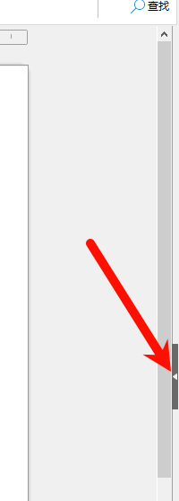
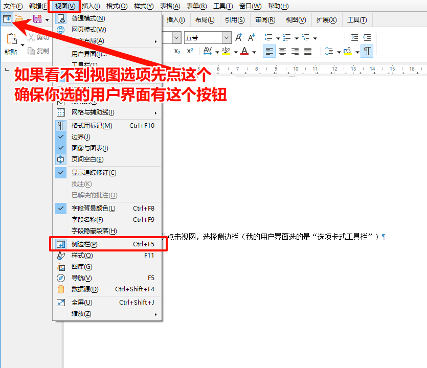
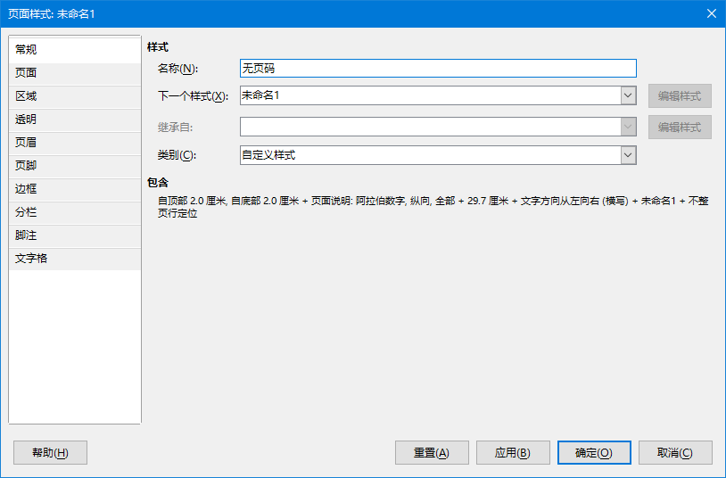
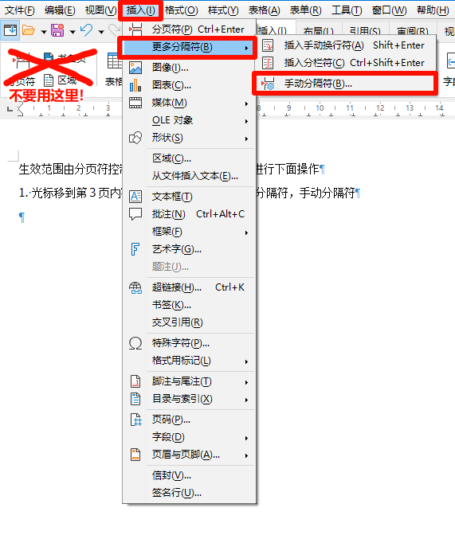
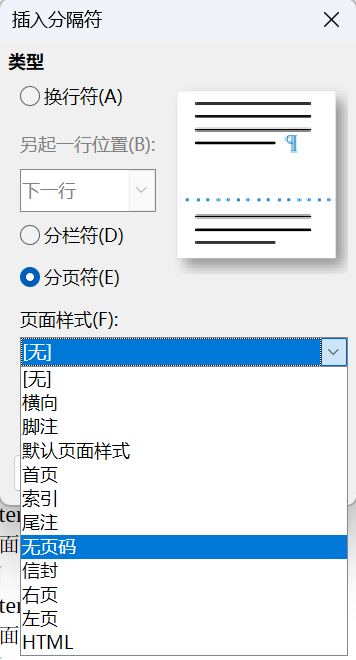
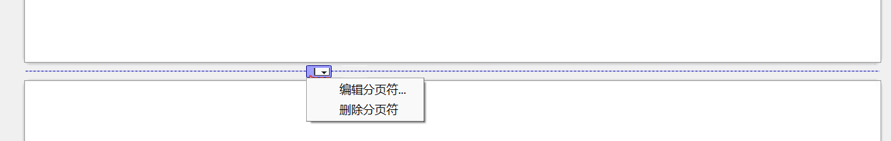

LibreOffice 想单独为特定一页或几页设置不同的页眉或页脚，按照微软Office的方法是不行的。本文同样适用于Openoffice

<!-- truncate -->

LibreOffice Writer 的逻辑是靠“不同页面样式 + 手动分页符”实现页码独立，因为页眉页脚是绑定页面样式的，不同样式就不会互相影响。

## 侧边栏操作
### 打开侧边栏

一般来说在文档右侧有个三角箭头，点开就可以看到边栏。

如果找不到，则可以点击视图，选择侧边栏（我的用户界面选的是“选项卡式工具栏”）

### 找到页面样式

打开侧边栏之后，选择样式（字母A带一只画笔按钮），选择页面样式（空白纸张带一只画笔按钮）

### 新建样式

右键空白处或任意一项，选择新建。

名称随便写，“下一个页面样式”不用理它，名称填写后自动选择，类别选自定义样式，点确定。

## 选择生效范围

生效范围由分页符控制，假设范围是4-5页，则进行下面操作

1. 光标移到第3页内容末尾，点插入，选择更多分隔符，手动分隔符

2. 在打开的窗口中选分页符，页面样式选刚新建的样式，不勾选更改页码

3. 光标移到第5页内容末尾，点插入，选择更多分隔符，手动分隔符
4. 在打开的窗口中选分页符，不过这次选择默认页面样式，让第5页之后的页面恢复原状，不勾选更改页码

以上操作后可以修改范围内的页眉或页脚，不影响其它页面

如果要修改范围，则要先删除分页符，鼠标停在`-------`分隔线上，点击按钮，删除分页符，然后再按上面的方法重新添加即可（注意你删除的是范围开始的分页符还是结束的分页符）

## 其它细节

1. 如果在范围内有页面的内容很满，插入页眉或页脚后部分内容会跑到新的一页，这个新的一页是包含在范围内的。
2. 如果再想让其它范围的页面也不同，则要再新建一个页面样式。
3. 新建的页面样式是保存到当前文档的，另外打开一个新文档是没有上一个文档的自定义样式。

## 参考文档

https://help.libreoffice.org/latest/zh-CN/text/swriter/guide/header_footer.html