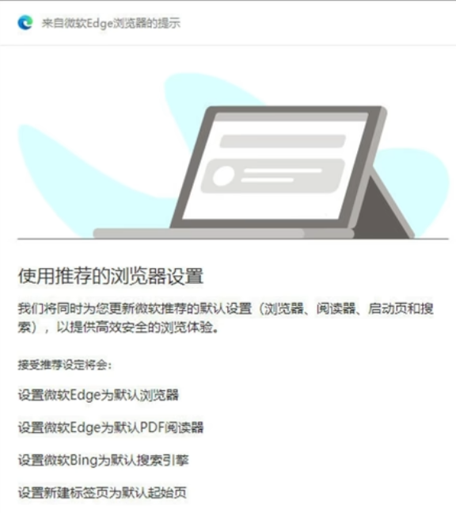

如果不将微软Edge浏览器设为默认，后续打开时总会有提醒设为默认浏览器，接受推荐的设置。

<!-- truncate -->

你是否遇到过下面的提示？




关掉后又出现出现？使用注册表就可以解决！

新建一个文本文件，粘贴以下内容：

```text showLineNumbers
Windows Registry Editor Version 5.00

[HKEY_LOCAL_MACHINE\SOFTWARE\Policies\Microsoft\Edge]
"ShowRecommendationsEnabled"=dword:00000000
"DefaultBrowserSettingEnabled"=dword:00000000
"DefaultBrowserSettingsCampaignEnabled"=dword:00000000
```

保存，之后将`txt`后缀改为`reg`，双击打开，确定合并即可

再次打开浏览器，出现“由你的组织管理”字样说明配置生效

## 参考资料

[Microsoft Edge - 策略](https://learn.microsoft.com/zh-cn/deployedge/microsoft-edge-policies)