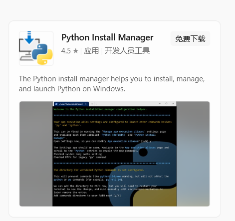

完整安装程序下载后一键安装将[终结于 3.14 版本](https://docs.python.org/zh-cn/3.15/using/windows.html#the-full-installer-deprecated)

新版 Python 安装方法，适用于 3.16 之后的版本。

{/* truncate */}

3.16 之后的版本官方使用 Python 安装管理器来管理 Python 版本。

安装方式改变后，缺点十分明显：

- 安装过程全程使用命令
- 不支持 Windows 10 以下版本（依赖  Microsoft Store）

## 安装 Python Install Manager

打开 Microsoft Store 搜索 “Python Install Manager” 或[点此直接跳转到详情页](https://apps.microsoft.com/detail/9nq7512cxl7t?hl=zh-CN&gl=CN)



或者到[Python 官方服务器上](https://www.python.org/ftp/python/pymanager)下载最新版`msix`后缀的安装程序。

安装完成后，在开始菜单找到 “Python Install Manager”，点击运行。

## 配置全局变量

打开后会出现下面类似的提示：

```shell
Welcome to the Python installation manager configuration helper.

********************************************************************************

The global shortcuts directory is not configured.

Configuring this enables commands like python3.14.exe to run from your
terminal, but is not needed for the python or py commands (for example, py
-V:3.14).

We can add the directory (C:\Users\AAMD\AppData\Local\Python\bin) to PATH now,
but you will need to restart your terminal to use it. The entry will be removed
if you run py uninstall --purge, or else you can remove it manually when
uninstalling Python.
Add commands directory to your PATH now? [y/N]
```

翻译过来大概是这样：

```
欢迎使用 Python 安装管理器配置助手。

********************************************************************************

全局快捷方式目录未配置。

配置此目录可使您在终端中运行类似 python3.14.exe 的命令，
但 python 或 py 命令（例如 py -V:3.14）不需要此配置。

我们现在可以将目录（C:\Users\AAMD\AppData\Local\Python\bin）添加到 PATH 中，
但您需要重新启动终端才能使用它。如果您运行 py uninstall --purge，该条目将被删除；
否则，您可以在卸载 Python 时手动删除它。

现在将命令目录添加到 PATH 中吗？[y/N]
```

输入 `y` 后回车，出现下面类似输出：

```shell
PATH has been updated, and will take effect after opening a new terminal.

********************************************************************************

You do not have the latest Python runtime.

Install the current latest version of CPython? If not, you can use 'py install
default' later to install.

Install CPython now? [Y/n]
```

## 安装 Python

出现 `Install CPython now? [Y/n]` 提示后输入 `y` 回车，下载最新稳定版 Python

```shell
Python install manager was successfully updated to xx.x.

Indexes can now be signed to provide tamper detection. When an index signature
is found to be invalid, the operation will be aborted without modifying your system.
See https://docs.python.org/using/windows#index-signatures for more information.

********************************************************************************
The signature for https://www.python.org/ftp/python/index-windows.json was successfully verified.
Installing Python x.xx.x.
Downloading: ..................................................................✅
Extracting: ...................................................................✅
To see all available commands, run 'py help'
********************************************************************************

********************************************************************************

Configuration checks completed.

To run these checks again, launch Python install manager from your Start menu,
or py install --configure from the terminal.

********************************************************************************

Usage:
    py <regular Python options>
                         Launch the default runtime with specified options. This
                         is the equivalent of the python command.
    py -V:<TAG>          Launch runtime identified by <TAG>, which should
                         include the company name if not PythonCore. Regular
                         Python options may follow this option.
    py -3<VERSION>       Equivalent to -V:PythonCore\3<VERSION>. The version
                         must begin with the digit 3, platform overrides are
                         permitted, and regular Python options may follow. py -3
                         is the equivalent of the python3 command.
    py exec <any of the above>
                         Equivalent to any of the above launch options, and the
                         requested runtime will be installed if needed.
    py help [<CMD>]      Show help for Python installation manager commands
    py install <TAG>     Download new Python runtimes, or pass --update to
                         update existing installs.
    py list [<FILTER>]   Show installed Python runtimes, optionally filtering by
                         <FILTER>.
    py uninstall <TAG>   Remove one or more runtimes from your machine. Pass
                         --purge to clean up all runtimes and cached files.

Find additional information at https://docs.python.org/using/windows.

View online help? [y/N]
```

出现 `View online help? [y/N]` 时输入 `n` 跳过查看在线帮助。

## 验证 Python 版本

打开 cmd 输入 `python --version` 查看已安装的版本。

至此，已正常安装 Python

## PyManager 基本使用

### 查看已安装的版本

```shell
py list
```

类似输出：

```
Tag           Name           Managed By  Version  Alias
3.14[-64]  *  Python 3.14.6  PythonCore  3.14.6   python3[-64].exe, python3.14[-64].exe
```
带有 `*` 的版本为默认使用的版本。

### 查看可安装的版本

```shell
py list --online
```

类似输出：

```
Tag                            Name                                     Managed By   Version   Alias
3.15-dev-32                    Python 3.15.0b3 (32-bit)                 PythonCore   3.15.0b3  python3[-32].exe, python3.15[-32].exe
3.15-dev[-64]                  Python 3.15.0b3                          PythonCore   3.15.0b3  python3-64.exe, python3.15-64.exe
3.15-dev-arm64                 Python 3.15.0b3 (ARM64)                  PythonCore   3.15.0b3  python3-arm64.exe, python3.15-arm64.exe
3.15t-dev-32                   Python 3.15.0b3 (32-bit, free-threaded)  PythonCore   3.15.0b3  python3.15t[-32].exe, python3t[-32].exe
3.15t-dev[-64]                 Python 3.15.0b3 (free-threaded)          PythonCore   3.15.0b3  python3.15t-64.exe, python3t-64.exe
3.15t-dev-arm64                Python 3.15.0b3 (ARM64, free-threaded)   PythonCore   3.15.0b3  python3.15t-arm64.exe, python3t-arm64.exe
```

Tag 被 `[ ]` 框住的即为适合当前系统架构的版本。

### 安装特定版本

```shell
# 自动安装合适架构的版本
py install <版本号>

# 手动安装架构的版本
py install <Tag>   # 例如：py install 3.15-dev-32
```

### 使用特定版本运行

```shell
# 使用默认版本运行
python <.py文件>

# 指定版本运行
python -V:3.14 <.py文件>

# 简写形式
python -3.14 <.py文件>
```

### 更新版本

```shell
# 更新所有已安装的版本
py install --upgrade

# 更新特定版本
py install --upgrade <版本号>
```

### 卸载 Python

```shell
# 卸载特定版本
py uninstall <版本号>

# 清空所有版本和缓存
py uninstall --purge
```

### 使用特定版本创建虚拟环境

```shell
python -V:<版本号> -m venv <存放虚拟环境的目录>
```

### 下载离线包与安装

```shell
# 下载离线包
py install -d <保存目录> <下载的版本>

# 安装离线包
py install -s <保存目录> <下载的版本>
```

:::warning
下载离线包与安装的前提是你已经安装了 Python Install Manager
:::

### 配置默认版本

如果你希望 python 命令默认使用某个版本，可以通过配置文件设置：

配置文件位置：`%AppData%\Python\PyManager.json`

不存在就在 `%AppData%` 下新建 `Python` 文件夹，在里面新建文件 `PyManager.json`，文件内容：

```json
{
  "default_tag": "<版本号>"
}
```

更多配置项可到[官方文档](https://docs.python.org/zh-cn/3.16/using/windows.html#configuration)中查看

之后可以[查看已安装的版本](#查看已安装的版本)查看默认的版本。

### 提取便携版（类似嵌入式包）

如果你需要一个不注册的、便携式的 Python（比如打包进你的程序）：

```shell
py install --target <保存目录> <版本号>

# 可以和离线包使用
py install -s <离线包目录> --target <保存目录> <版本号>
```

这会把 Python 解释器提取到指定目录，不会创建任何快捷方式或注册表项。

:::warning
使用便携版需有一定的使用经验，其余情况下请正常安装 Python
:::

## 参考资料

[PyManager：Windows 上安装 Python 的新方式](https://www.luogu.com.cn/article/by0qjpzi)

[Python Install Manager 使用手册（Windows）](https://www.cnblogs.com/a120608yby/p/20198926)

[Python Documentation](https://docs.python.org/zh-cn/3/using/windows.html)