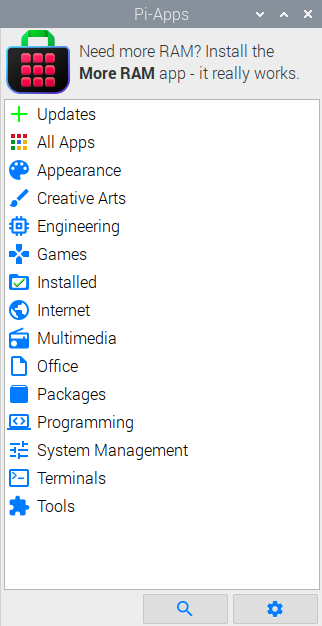
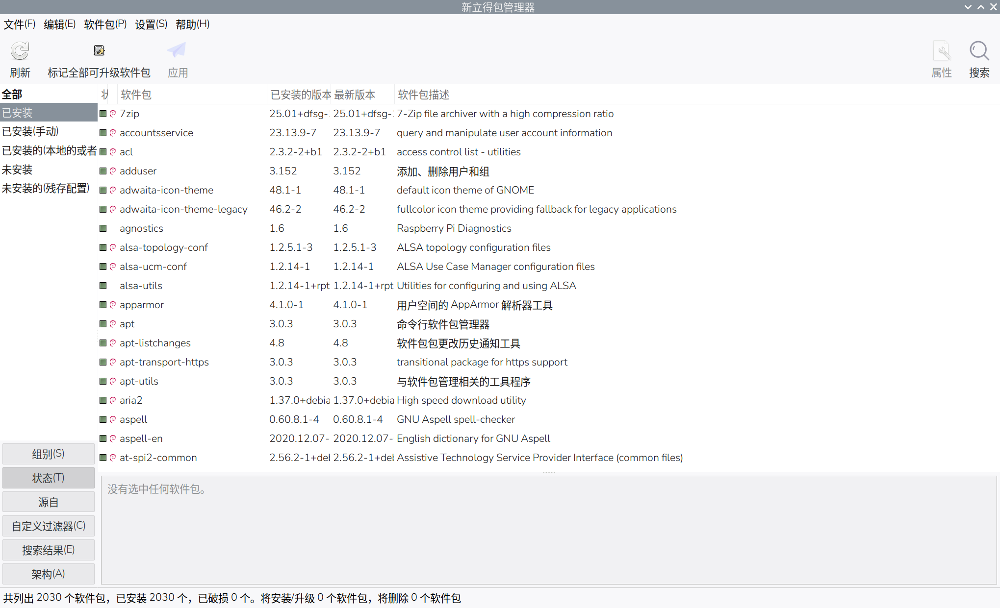
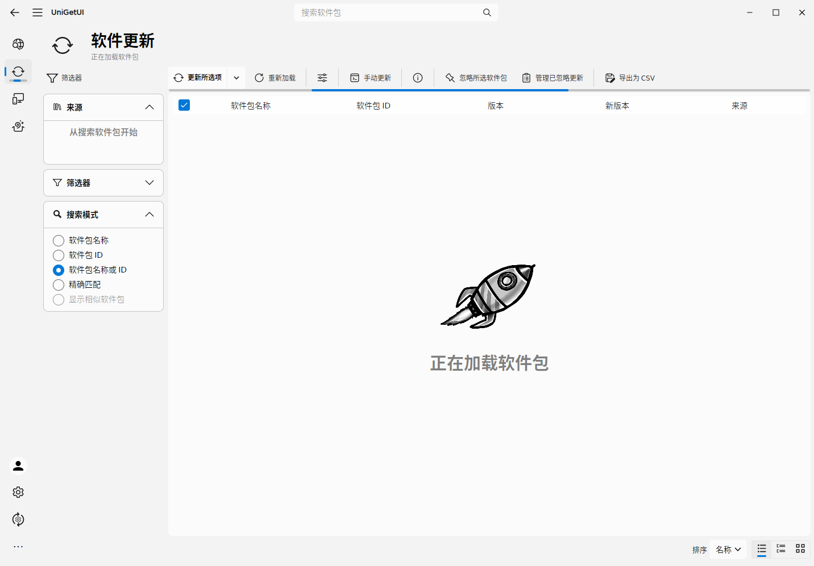
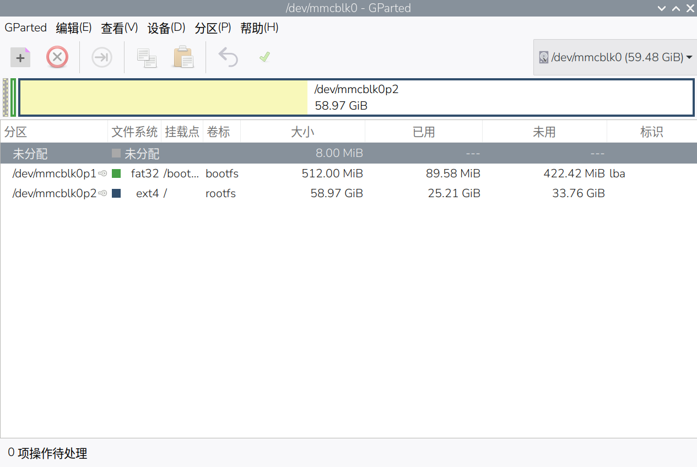
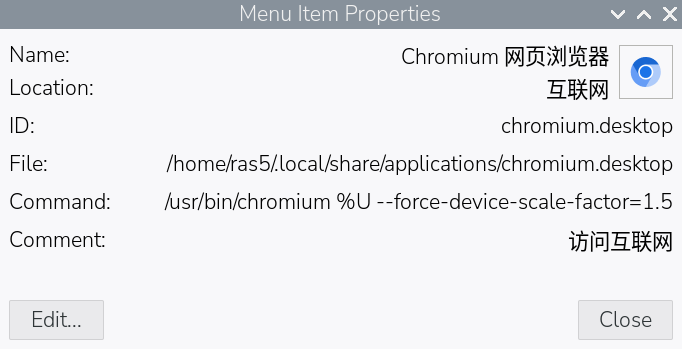
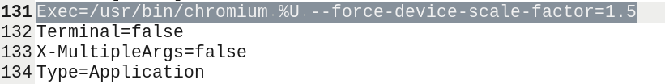

解决一些如小数字键盘、界面缩放、Java安装等问题。

{/* truncate */}

:::tip
以下内容使用树莓派 5 进行尝试
:::
## 安装中文输入法

使用 Fcitx 5 来支持中文输入：

```bash
sudo apt install fcitx5 fcitx5-chinese-addons
```

## 软件库补充

有些软件在官方库里没有（如 Steam），我的选择是使用 [Pi-Apps](https://pi-apps.io)



具体安装方法可以到官网查看。

## 截图工具

系统其实自带了一个命令行的截图工具，但不方便使用。

如果直接按下 <kbd>PrintScreen</kbd> 则可以直接保存当前屏幕截图到 `图片` 文件夹下。

如果只想截取区域，需要使用下面的脚本：

使用之前先确保必要软件已安装：

```bash showLineNumbers
sudo apt update
sudo apt install grim slurp wl-clipboard
```

<Tabs>
<TabItem value="1" label="区域截图（不存文件）" default>

```bash title='区域截图（不存文件）.sh'
# 截图后自动复制到剪贴板
region=$(slurp) && grim -g "$region" - | wl-copy
```

</TabItem>
<TabItem value="2" label="区域截图">

```bash title='区域截图.sh'
# 截图后自动复制到剪贴板并保存截图
region=$(slurp) && grim -g "$region" - | tee "$HOME/图片/areashot-$(date +%F_%T).png" | wl-copy
```

</TabItem>
<TabItem value="3" label="全屏截图">

```bash title='全屏截图.sh'
# 效果同按下 PrintScreen 不自动复制到剪贴板
grim ~/图片/shot-$(date +%F_%T).png
```

</TabItem>
</Tabs>

按 <kbd>Esc</kbd> 或鼠标右键取消截图。

:::warning[注意]

执行 `.sh` 脚本前确保有可执行权限（可在 UI 桌面环境下右键进入属性设置或使用 `chmod +x <文件名>` 来给文件添加权限）

某些程序（GTK3 老应用）只认 X11 剪贴板，可装 wl-clipboard-x11 桥接，或直接存文件再使用。

系统语言为中文时，图片文件夹名称为 `图片`，在英文系统下名称为 `Pictures`，实际以文件管理的路径显示为准。

:::

## PWM 可调速风扇

使用 root 权限打开 `/boot/firmware/config.txt` 文件，找到 `[all]` 段在后面添加：

```ini showLineNumbers
dtparam=cooling_fan=on
dtparam=fan_temp0=45000,fan_temp0_hyst=5000,fan_temp0_speed=75
dtparam=fan_temp1=55000,fan_temp1_hyst=5000,fan_temp1_speed=125
dtparam=fan_temp2=67500,fan_temp2_hyst=5000,fan_temp2_speed=185
dtparam=fan_temp3=75000,fan_temp3_hyst=5000,fan_temp3_speed=250
```

- 温度是毫摄氏度（如 45000 = 45℃），`fan_tempN_speed` 取值 0–255（75≈30%、125≈50%、250≈100%）
- `fan_tempN` 起转温度，`fan_temp0_hyst` 停转的降温值（如 45000 - 5000 = 40000 = 40℃ 时停转）

### 全速风扇

可以临时让风扇全速转动。

```bash title='全速风扇.sh' showLineNumbers
#!/bin/bash

FAN="/sys/class/thermal/cooling_device0"
MAX=$(cat "$FAN/max_state")

echo "风扇全速运行（按Ctrl+C恢复）"
echo "$MAX" | sudo tee "$FAN/cur_state" > /dev/null

restore() {
    echo -e "\n恢复中..."

    # 先切到最低档，让 governor 重新接管
    echo 1 | sudo tee "$FAN/cur_state" > /dev/null

    sleep 0.5

    # 再交还控制权
    echo 0 | sudo tee "$FAN/cur_state" > /dev/null

    sleep 1

    STATE=$(cat "$FAN/cur_state")
    TEMP=$(vcgencmd measure_temp)

    echo "完成"
    echo "cur_state=$STATE"
    echo "$TEMP"
    exit 0
}

trap restore INT

# 保持全速
while true; do
    echo "$MAX" | sudo tee "$FAN/cur_state" > /dev/null
    sleep 1
done
```
:::warning[注意]

必须使用 <kbd>Ctrl+C</kbd> 来恢复，否则将一直全速转动！

如出现重启后恢复。

:::

## 图形软件包管理器

### Synaptic

对于刚上手使用或想批量处理软件包可以使用新立得（Synaptic）

Synaptic 是一款基于 GTK 和 APT 的图形包管理工具，以用户友好的方式安装、升级和删除软件包。



```bash
sudo apt install synaptic
```

### UniGetUI

UniGetUI 与 synaptic 类似，但可以管理很多类型的软件包管理器。



下载 [UniGetUI](https://github.com/Devolutions/UniGetUI#linux)

:::warning[注意]

安装成功后启动时一闪而过则需要一些步骤：

1. 安装 inter 字体 `sudo apt install fonts-inter`
2. 修改桌面项或菜单项，找到 `command` 或 `Exec`，替换为 `env LANG=C.UTF-8 LC_ALL=C.UTF-8 /usr/bin/unigetui`。主要是必须有 `env LANG=C.UTF-8 LC_ALL=C.UTF-8` 这一段，`/usr/bin/unigetui` 根据实际路径修改。
3. 重启系统。

:::

## 图形硬盘分区软件



```bash
sudo apt install gparted
```

## 浏览器界面缩放

浏览器在一些小屏幕下会显示得很大，而在大屏幕下却显示得很小。

### 火狐

在地址栏中输入 `about:config`，接受风险并继续。

之后搜索 `ui.textScaleFactor`，调整数值，数值越大界面越大。

### Chromium 类浏览器（如 Chrome）

这类浏览器在软件内没有对应的修改项，需要使用启动命令。

修改浏览器的桌面项或菜单项，找到 `command` 或 `Exec`，在原有内容后添加：

```ini
 --force-device-scale-factor=1.5
```
该参数控制界面缩放倍数，数值越大界面越大。

添加后示例：





## 配置 JDK 系统环境

JDK 是 java 的开发运行库，包含 jre。

有些安装包是压缩包形式，不会自动添加到系统环境中。下面教你如何添加。

:::tip
假设我已经将 JDK 解压到 `/home/ras5/jdk`

如果是 jre 下面步骤相同。
:::

需要 root 权限打开 `/etc/profile` 文件，末尾添加下面内容：

```bash
export JAVA_HOME=/home/ras5/jdk
export CLASSPATH=.:$JAVA_HOME/lib
export PATH=$JAVA_HOME/bin:$PATH
```

添加后示例文件：

```bash title='/etc/profile' showLineNumbers
# 其余文件内容...
if [ -d /etc/profile.d ]; then
  for i in $(run-parts --list --regex '^[a-zA-Z0-9_][a-zA-Z0-9._-]*\.sh$' /etc/profile.d); do
    if [ -r $i ]; then
      . $i
    fi
  done
  unset i
fi

# highlight-start
export JAVA_HOME=/home/ras5/jdk
export CLASSPATH=.:$JAVA_HOME/lib
export PATH=$JAVA_HOME/bin:$PATH
# highlight-end
```

配置好后重启系统，之后使用 `java --version` 来查询 java 版本号是否为自己安装的版本，出现错误或版本不一致则没有配置正确或与系统中原有的版本冲突。

## Flatpak 应用桌面菜单不显示问题

解决安装的新应用没有显示在菜单的问题，一般会出现下面警告：

```bash
请注意 

'/var/lib/flatpak/exports/share'
'/home/ras5/.local/share/flatpak/exports/share'

目录不在由 XDG_DATA_DIRS 环境变量设置的搜索路径中，因此通过 Flatpak
安装的应用在会话重启前可能不会出现在您的桌面。
```

打开 `~/.profile` 文件，末尾加：

```bash title='~/.profile' showLineNumbers
if [ -n "$XDG_DATA_DIRS" ]; then
  XDG_DATA_DIRS="$XDG_DATA_DIRS:/var/lib/flatpak/exports/share:$HOME/.local/share/flatpak/exports/share"
else
  XDG_DATA_DIRS="/usr/local/share:/usr/share:/var/lib/flatpak/exports/share:$HOME/.local/share/flatpak/exports/share"
fi
export XDG_DATA_DIRS
```

配置好后重启系统。

## 使用 VSCodium/VSCode/Cursor 时会出现 unlock keyring 的问题

第一次启动时会要求你创建一个密码，这个密码是保护你该软件的登陆凭据（如 Github 登陆凭据）。

如果你设置了密码，那么每次启动时都会要求输入设置好的密码，当然可以直接关闭不用密码，不影响软件运行，但登陆凭据无法读取不能自动登陆。

不想每次启动时要求输入密码且可以访问凭据，最简单的办法就是**第一次启动创建密码时直接留空不设密码**，这样就会自动读取凭据但不会要求你输入密码。

**但要注意：任何有文件访问权限的软件都可以读取到。安全和便利两者不可兼得。**

### 忘记密码但每次都会弹出

删除 `~/.local/share/keyrings` 目录，会丢失之前存的所有凭据，再次打开软件就有提示创建一个密码重新开始。

### 记得密码想修改密码

安装 `sudo apt install seahorse` ，之后进入该软件，有可能你会直接进到 GnuPG 密钥界面中，点左上角箭头返回。

返回后在密码这一项中会有一条 `Default Keyring` （具体名称以创建时为准），右键这条选更改密码，输入旧密码后即可设置新密码。

## 让数字小键盘一直可用

系统默认到下一次启动后，小键盘的数字锁定键不锁定，导致按数字却打不出来。

使用 [numlockw](https://github.com/xz-dev/numlockw) 来帮你在系统启动后开启数字锁定键。

使用该软件前先安装 [pipx](https://pipx.pypa.io/latest/how-to/install-pipx.html)

```bash showLineNumbers
sudo apt install pipx
pipx ensurepath
```

重启终端后执行：

```bash
sudo usermod -a -G plugdev $USER
pipx install numlockw
```

由于网路问题可能要等很久。

下面是 numlockw 的用法，具体可以到 Github 上查看：

```bash
usage: numlockw [-h] [--device-name DEVICE_NAME] [--no-fake-uinput]
                [--pre-hook PRE_HOOK] [--force-led] [--wait-dev]
                {on,off,toggle,status,list-devices} ...

numlockw is a program to control the NumLock key, designed for use with
Wayland and tty environments.

options:
  -h, --help            show this help message and exit
  --device-name, --dev DEVICE_NAME
                        The name of the input device or "*" for each one. If
                        not provided, will fake keyboard to enable NumLock,
                        and enable LDE_NUML on all devices that support it.
  --no-fake-uinput      Do not fake uinput device, use real devices
  --pre-hook PRE_HOOK   A command to run when NumLock is toggled. The command
                        will be run with the status of uinput device name
                        ${{udevice}}.
  --force-led           Force setting LED_NUML on all devices that support it,
                        not dependent system to set it.
  --wait-dev            Wait indefinitely for the device specified by
                        --device-name to become available. Useful in init
                        scripts where devices may not be ready yet.

actions:
  valid actions

  {on,off,toggle,status,list-devices}
                        action to perform on NumLock
    on                  Turn NumLock on
    off                 Turn NumLock off
    toggle              Toggle NumLock
    status              Display NumLock status
    list-devices        List devices that support NumLock
```

简单点说：

- `numlockw on` 开启数字锁定键
- `numlockw off` 关闭数字锁定键
- `numlockw list-devices` 显示连接的键盘
- `numlockw --dev 'DEVICE_NAME' on` 开启一个名称为 `DEVICE_NAME` 设备上的数字锁定键
- `numlockw --force-led --dev 'DEVICE_NAME' on` 开启一个名称为 `DEVICE_NAME` 设备上的数字锁定键并强制启用 LED 灯

将开启数字锁定键添加至开机运行命令中 `~/.config/labwc/autostart` ，没有该文件就新建：

```bash title='~/.config/labwc/autostart'
numlockw on
```